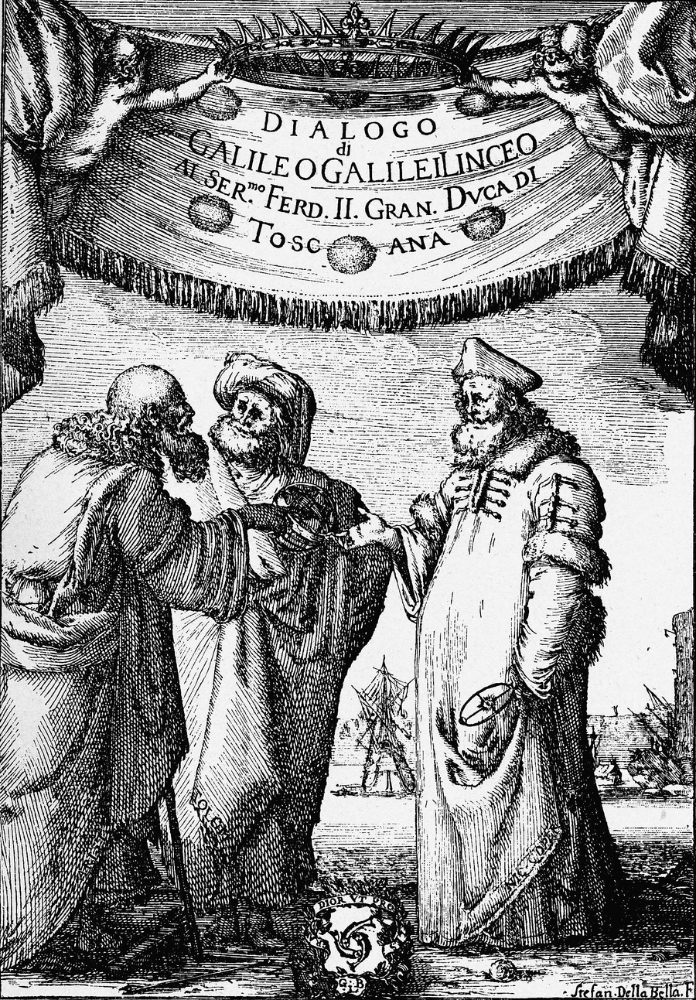
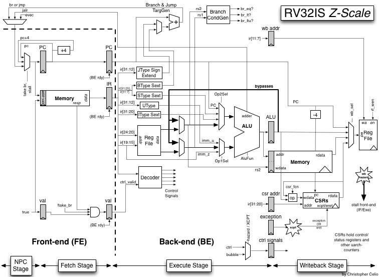
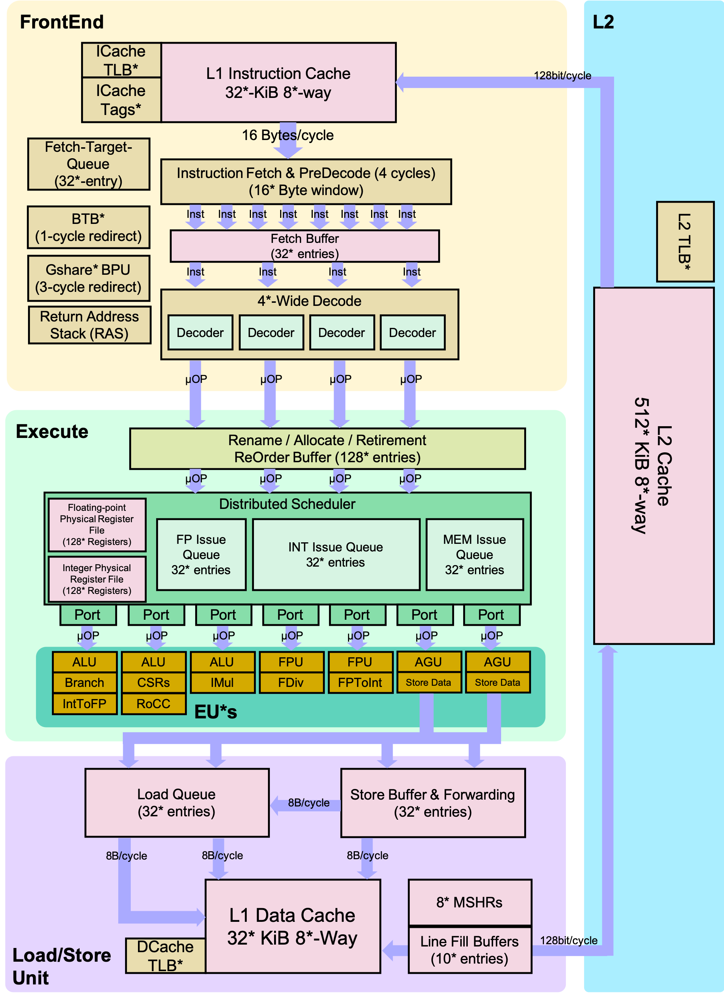

<br>

<div class="mobile-only">

> You are viewing this on a mobile device, but SITP is best viewed on a desktop — the book includes various multimedia lecture videos, visualizers, any tufte-style sidenotes with many external hyperlinks to other resources.

</div>

> We<span class="sidenote-number"></span><span class="sidenote">*The following is a modified excerpt from The Structure and Interpretation of Computer Programs [Chapter 1: Building Abstractions with Procedures](https://mitp-content-server.mit.edu/books/content/sectbyfn/books_pres_0/6515/sicp.zip/full-text/book/book-Z-H-9.html#%_chap_1)*</span> are about to study the idea of a computational process. Computational processes are abstract beings that inhabit computers. As they evolve, processes manipulate other abstract things called data. The evolution of a process is directed by a pattern of ~~rules called a program~~ <a href="">*parameters called a model*</a>. People ~~create programs~~ <a href="">*train models*</a> to direct processes. In effect, we conjure the spirits of the computer with our spells.<br><br>
A computational process is indeed much like a sorcerer's idea of a spirit. It cannot be seen or touched. It is not composed of matter at all. However, it is very real. It can perform intellectual work. It can answer questions. It can affect the world by disbursing money at a bank or by controlling a robot arm in a factory. The ~~programs~~ <a href="">*models*</a> we use to conjure processes are like a sorcerer's spells. They are carefully ~~composed~~ <a href="">*recovered*</a> from ~~symbolic~~ <a href="">*numerical*</a> expressions in arcane and ~~esoteric~~ <a href="">*parallel*</a> programming languages that prescribe the ~~tasks~~ <a href="">*losses*</a> we want our processes to ~~perform~~ <a href="">*minimize*</a>.

# I. Elements of Networks<br>

 Although separated by over 2000 years, the programmers of Silicon Valley face a daunting task
quite similar to the one encountered by the mathematicians of Ancient Greece.
That is, to contribute towards this new approach of augmenting and amplifying human intelligence,
they must climb back down from their current pitch and backtrack to the beginner's mind they once had.

Not different from learning another mathematical or programming language, they must transition from
their *finitely discrete structures* and *deterministic procedures* tooling they have grown acustomed to
and make the transition to the *infintely continuous structures* and *stochastic procedures*.
Back then, ancient greek mathematicians were only comfortable with the finiteness of natural numbers like $1$, $2$, and $3$,
and had to grapple with the infinite nature of the real numbers such as $\sqrt{2}$, $\pi$, and $e$.
Similarly, the programmers of today are being asked to transition from programming algorithms of *sets, maps, lists, trees, and graphs*
to the distributions of *scalars, vectors, matrices, tensors, and neural networks*.

More coloquially, programmers interested in the deep learning approach to artificial intelligence must make the transition
from <span class="defnote">**software 1.0**</span>**software 1.0**
to <span class="defnote">**software 2.0**</span>**software 2.0**<span class="sidenote-number"></span><span class="sidenote">*See [(Karpathy 2017)](https://karpathy.medium.com/software-2-0-a64152b37c35)*</span>, a distinction used to differentiate the classical act of programming software line by line,
and the newer approach of programming software by specifying a dataset, a neural net architecture with a goal, and searching the space of programs with compute.
How to exactly program with this new approach will take the remainder of the book to explain.

While software 2.0 has increased the intelligence and autonomy of our devices throughout the past decade
— to name a few, language understanding with Google's Translate and Apple's Siri, vision understanding with Tesla Autopilot —
at the end of 2022 ChatGPT was released to the world which marked the beginning
of <span class="defnote">**software 3.0**</span>**software 3.0**<span class="sidenote-number"></span><span class="sidenote">*See [(Andrej Karpathy 2025)](https://www.youtube.com/watch?v=LCEmiRjPEtQ)*</span>,
enabling the activity of programming with none other than the English language.
What may be surprising to realize at first glance is that artificial intelligence like ChatGPT is "just" another computer program.
However, rather than being implemented in a language like C, Java, or Javascript, it's implemented in one that goes by the name of **PyTorch**,
a software 2.0 programming language centered around the multidimensional array data structure known as `torch.Tensor`, humbly embedded within a Python package.

In this whirlwind tour dubbed **The Structure and Interpretation of Tensor Programs (SITP)**, we will embark on a quest to build from scratch
our own deep neural network like ChatGPT by implementing [`nanochat`](http://github.com/karpathy/nanochat)
and our own deep learning framework like PyTorch by implementing [`teenygrad`](https://github.com/j4orz/teenygrad).
Whether you're an eager high school student, an up coming college student, or a battle-tested industry programmer,
**SITP** has been meticulously designed so that the only prerequisite required
is a basic familiarity with the art of programming, and high school algebra.
Any additional experience is helpful, not mandatory.

So with that all said, go on young hacker. Venture forth!<br>

## Table of Contents
<!-- 1. eigen value/singular value -->
<!-- 2. linear systems, least squares? -->
<!-- 3. BLAS -->
<div class="toc">

- [0. From Symbolic Software 1.0 to Stochastic Software 2.0](#0-from-logical-software-10-to-stochastic-software-20)
  - [0.1 From Psychology to Artificial Intelligence](#01-from-psychology-to-artificial-intelligence)
  - [0.2 Weizenbaum's Turing Test Cheater](#02-weizenbaum-cheats-turings-test-with-the-pattern-matching-of-eliza) <!-- with the Pattern Matching of `ELIZA` -->
  - [0.3 Wood's Winograd Challenge](#03-woods-winograd-challenge-with-the-translation-of-lunar) <!-- with the Translation of `LUNAR` -->
  <!-- - [0.4 Feigenbaum's Narrow Expertise with the Heuristics of `DENDRAL`](#04-feigenbaums-narrow-expertise-with-the-heuristics-of-dendral) -->
  - [0.4 Lenat's Advice Taker](#04-lenats-advice-taker-with-the-frames-of-cyc) <!-- with the Frames of `CYC` -->
  - [0.5 From the Tractatus to Investigations]() <!-- logical to distributional semantics -->
  - [0.6 Summary](#06-summary)
  - [0.7 Bibliographic Notes](#07-bibiliographic-notes)
  - [0.8 Problems](#08-problems)
- [*Intermezzo One: The Language of Sets and Logic*](#intermezzo-one-the-language-of-sets-and-logic)
- [1. Syntactic Sequence Learning](#1-syntactic-sequence-learning)
  - [1.1 From Certain to Uncertain Knowledge](#11-from-certain-to-uncertain-knowledge) <!-- Probability -->
  - [1.2 Language as a Weighted Set of Strings](#12-language-as-a-weighted-set-of-strings)
  - [1.3 From Variables to Random Variables](#13-from-variables-to-random-variables)
  - [1.4 Statistics as Inverse Probability]() <!-- Statistics -->
  - [1.5 Iteratively Fitting Logistic Regression]() <!-- $\mathscr{L(\theta)} := $ --> <!-- with Cross Entropy Loss -->
  - [1.6 Directly Fitting Linear Regression]() <!-- with least squared error -->
  - [1.7 Summary]()
  - [1.8 Bibliographic Notes](#18-bibliographic-notes)
  - [1.9 Problems]()
- [*Intermezzo Two: The Language of Probability and Matrix Calculus*](#intermezzo-two-the-language-of-probability-and-matrix-calculus)
- [2. From IPL's Array to APL's Multidimensional Array](#2-from-ipls-array-to-apls-multidimensional-array)
  - [2.1 From Virtual to Physical Machines (and Shapes)](#21-from-virtual-to-physical-machines-and-shapes) <!-- three language problem: rust translation and risc-v evaluation -->
  - [2.2 Accelerating the Communication of Hierarchies]()
  - [2.3 Accelerating the Computation of Pipelines]()
  - [2.4 From Abstract to Numerical Linear Algebra]()
  - [2.6 Summary]()
  - [2.7 Bibliographic Notes]()
  - [2.8 Problems]()
- [*Intermezzo Three: The Language of Numerical Analysis*]()
</div>

<!-- - [1.7 Matrix Factorizations: Eigenvalues, Singular Values, and their Decompositions]()
  - [1.8 Learning Subspaces with Principal Component Analysis via Maximum Variance]() -->
  <!-- - [2.2 Predicting Scalars by Linearly Modeling Regression]() $f: \reals^d \to \reals$
  - [2.3 Directly Fitting Linear Regression with Squared Error Loss](#) $\mathscr{L(\theta)} := $ -->

## 0. From Symbolic Software 1.0 to Stochastic Software 2.0
<small>[$\hookleftarrow$ Table of Contents](#table-of-contents)</small>

> In which we retrace the development and failure of the discretely symbolic approach to build artificially intelligent machines with common sense and motivate the need to transition from logical and finitely discrete software 1.0 to stochastic and infintely continuous software 2.0.
<!-- $p(X=x)$ from $D=\{x^{(i)}\}_{i=1}^{n}$ -->

### 0.1 From Psychology to Artificial Intelligence

The study of the mind is no different from the areas of mathematics or music
— although their forms change throughout time, their substances remain eternal.
What do we mean by such high fallutin speak?
What we mean is that in mathematics, representations or notations for arithmetic have evolved
from dashes on cave walls, to roman numerals, and finally to modern position-based hindu arabic numerals;
In music, representations or also notation for pitch have evolved from neumes, relative staffs, and to the five-line staff;
And finally, with the mind, representations or model for intelligence have evolved from stimulus-response to neural networks.

The transition between the two representations happened relatively recently at a summer worshop at Dartmouth in 1956.
There, a group of researchers unsatisfied with the theories that the discipline of psychology were using
to explain the phenomena of the mind and it's intelligence came together to discuss a different approach,
namely, one where the computer is the instrument for conducting scientific experiment.
Although seemingly trivial from the modern perspective where most if not all sciences use the computer,
they were were arguably the first with motivation arisen from the epistemological:
using the computer as basis for the science of mind (and all sciences in general) strengthened it's explanations
from the *observationally simple* like stimulus-response to the *constructively complex* such as neural networks<span class="sidenote-number"></span><span class="sidenote">*Practical applications are often a result of inquiry that is philosophical and gradiose with no immediately obvious economic value. Namely, computers with Hilbert wanting to automate mathematics as beers, tables and mugs; language models with McCarthy, Minsky, Newell and Simon wanting to mechanize and naturalize the mind.*</span>.
That is, constructive because explaining via computer means *simulating* the phenomena by programming processes with procedures.
And, complex because computers allow for the *simulating* of many things at
once<span class="sidenote-number"></span><span class="sidenote">*Paraphrasing Minsky, "Under certain conditions mathematical analysis can describe complex phenomena where the parts of the system can be treated as individual and independently random (i.e statistical thermodynamics), but there is no reason to suspect that intelligence is the result of averaging out many events."*</span>.
The proposal for the workshop states:

> We propose that a (...) study of artificial intelligence be carried out (...) the study is to proceed on the basis of the conjecture that every aspect of learning or any other feature of intelligence can in principle be so precisely described that a machine can be made to simulate it.

Besides the intellectual pursuit of finding better explanations for a clearer picture of reality, using the computer also means something quite practically profound.
If the explanation it comes up with are accurate, we will have artificial systems that exhibit behavior which we would attribute intelligence to.
This is what the Turing Test posited and predicted in 195X (todo, read computing machinery and intelligence).
<span class="defnote">**artificial intelligence**</span>**artificial intelligence**
<span class="defnote">**natural language processing**</span>**natural language processing**
<span class="defnote">**computational linguistics**</span>**computational linguistics**. And this is why we have ChatGPT.

In this book we embark on a quest to build from scratch our own deep neural network like ChatGPT by implementing [`nanochat`](http://github.com/karpathy/nanochat)
and our own deep learning framework like PyTorch by implementing [`teenygrad`](https://github.com/j4orz/teenygrad) capable of running nanochat itself.
These systems by nature are *stochastic and infintely<span class="sidenote-number"></span><span class="sidenote">*Turns out not quite infinte, as we will see in chapter 3.*</span> continuous*
software 2.0 rather than the *logical and finitely discrete* software 1.0 and are implemented not by programming algorithms and their procedures line by line with sets, maps, lists, trees, and graphs,
but rather, by searching the space of programs by providing a goal to calculus, which then optimizes said goal — in the case of ChatGPT, producing a probability distribution over tokens — with the linear algebra of tensors.
However, there was a time where the dominant approach involved using software 1.0 and in chapter 0 we will build various systems using such techniques to display their shortcomings,
understanding the underlying philosophical principle, and ultimately motivating the need for
software 2.0<span class="sidenote-number"></span><span class="sidenote">*The art of programming software 1.0 is necessary however on your quest to learn software 2.0! PyTorch is embedded and implemented within Python afterall. For instance, to those who spent countless nights learning esotoric spells such as that of dynamic programming to enter the kingdoms of our feudal lords only to create web page buttons should not fret as it turns out that dynamic programming over a graph is in fact the beating heart of all deep learning frameworks.<br><br>If you'd like to revisit the fundamentals of programming, we recommend the [Data Centric Introduction to Computing](), which begins with the teaching language Pyret and graduates to Python.*</span>

briefly mention
intelligence must be told knowledge before learning it
and such knowledge should be represented a symbolic logic

- mccarthy's excerpts from "programs with common sense"
- minsky's "descriptive languages and problem solving"
- newell and simon's symbolic hypothesis
- newell knowledge level

Are you ready to begin?

### 0.2 Weizenbaum Cheats Turing's Test with the Pattern Matching of `ELIZA`

<script src="assets/elizabot/elizabot.js"></script>
<script src="assets/elizabot/elizadata.js"></script>
<div style="display: flex; gap: 1rem; align-items: flex-start; margin: 1.5rem 0;">
<div id="eliza-widget" style="
  flex: 1;
  min-width: 0;
  font-family: var(--mono-font, 'Source Code Pro', monospace);
  font-size: 0.85em;
  background: var(--quote-bg);
  border-radius: 6px;
  padding: 1rem;
">
  <div style="opacity:0.5;font-size:0.8em;margin-bottom:0.5rem;user-select:none;">ELIZA 1966</div>
  <div id="eliza-log" style="
    height: 260px;
    overflow-y: auto;
    margin-bottom: 0.75rem;
    display: flex;
    flex-direction: column;
    gap: 0.35rem;
  "></div>
  <form id="eliza-form" style="display: flex; gap: 0.5rem;">
    <input id="eliza-input" type="text" autocomplete="off" placeholder="say something…" style="
      flex: 1;
      background: var(--bg);
      color: var(--fg);
      border: 1px solid var(--quote-border, #444);
      border-radius: 4px;
      padding: 0.4rem 0.6rem;
      font: inherit;
      outline: none;
    ">
    <button type="submit" style="
      background: var(--quote-bg);
      color: var(--fg);
      border: 1px solid var(--quote-border, #444);
      border-radius: 4px;
      padding: 0.4rem 0.8rem;
      font: inherit;
      cursor: pointer;
    ">send</button>
  </form>
</div>
<script src="assets/elizabot/eliza-widget.js"></script>

<div id="qwen-widget" style="
  flex: 1;
  min-width: 0;
  font-family: var(--mono-font, 'Source Code Pro', monospace);
  font-size: 0.85em;
  background: var(--quote-bg);
  border-radius: 6px;
  padding: 1rem;
">
  <div style="opacity:0.5;font-size:0.8em;margin-bottom:0.5rem;user-select:none;">QWEN 2025</div>
  <div id="qwen-key-prompt" style="margin-bottom: 0.75rem; display: flex; gap: 0.5rem; align-items: center;">
    <input id="qwen-key" type="password" placeholder="OpenRouter API key…" style="
      flex: 1;
      background: var(--bg);
      color: var(--fg);
      border: 1px solid var(--quote-border, #444);
      border-radius: 4px;
      padding: 0.4rem 0.6rem;
      font: inherit;
      outline: none;
    ">
    <button id="qwen-key-save" type="button" style="
      background: var(--quote-bg);
      color: var(--fg);
      border: 1px solid var(--quote-border, #444);
      border-radius: 4px;
      padding: 0.4rem 0.8rem;
      font: inherit;
      cursor: pointer;
    ">save</button>
  </div>
  <div id="qwen-log" style="
    height: 260px;
    overflow-y: auto;
    margin-bottom: 0.75rem;
    display: flex;
    flex-direction: column;
    gap: 0.35rem;
  "></div>
  <form id="qwen-form" style="display: flex; gap: 0.5rem;">
    <input id="qwen-input" type="text" autocomplete="off" placeholder="say something…" style="
      flex: 1;
      background: var(--bg);
      color: var(--fg);
      border: 1px solid var(--quote-border, #444);
      border-radius: 4px;
      padding: 0.4rem 0.6rem;
      font: inherit;
      outline: none;
    ">
    <button type="submit" style="
      background: var(--quote-bg);
      color: var(--fg);
      border: 1px solid var(--quote-border, #444);
      border-radius: 4px;
      padding: 0.4rem 0.8rem;
      font: inherit;
      cursor: pointer;
    ">send</button>
  </form>
</div>
</div>
<script src="assets/elizabot/qwen-widget.js"></script>

Humans, it seems, know things: and what they know helps them do things.
The early approach to artificial intelligence using logical and finitely discrete techniques from software 1.0
focused on building systems that <span class="defnote">**reasoning**</span>**reasoned** over an internal <span class="defnote">**representation**</span>**representation** of knowledge.
Iteratively deepening software 1.0's symbolic perspective of such terms will be the focus of this first
chapter<span class="sidenote-number"></span><span class="sidenote">*By the end of the book you will have come to understand the software 2.0 perspective of such terms.*</span>.

Although there was various flavors of the symbolic approach to AI — game playing, puzzle solving, problem solving to name a few —
our focus is on building conversational machines within the realm of natural language processing and computational linguistics, to pass something like the aforementioned Turing Test.
With that said, **what is the simplest way to build a conversational machine with the logical and finitely discrete techniques from software 1.0?**

> [!WARNING]
>  Pause and think!<br style="clear: both;">

**What if we represented words with `str`s and, produce answers as output with `if` statements conditioned on questions as input?**

That's effectively what the `ELIZA`<span class="sidenote-number"></span><span class="sidenote">*See [**A Computer Program For the Study of Natural Language Communication Between Man and Machine (Weizenbaum 1966)**](https://dl.acm.org/doi/epdf/10.1145/365153.365168)*</span>
system does<span class="sidenote-number"></span><span class="sidenote">*Do you feel dissapointed after learning ELIZA's trick? The trick with all explanations is that after the explanation, no trick remains. See [Matter, Mind, and Models (Minsky 1965)](), and [The Nature of Explanation (Craik 1952)](). You might feel the same way by the end of the book even after learning how [nanochat]() and [teenygrad]() work under the hood. Don't say we didn't warn you!*</span> to imitate a Rogerian psychotherapist.

For instance, a question that tends to get asked is the meaning of life.
Answering such question seems quite grandiose for now, so let's have our system produce some random string for now.
Let's document and interatively test our example<span class="sidenote-number"></span><span class="sidenote">*The implementation of all functions implemented in the book will start with examples, following the principled design of programs with the [How to Design Programs' Design Recipe](). We still find it useful in the era of agentic coding.*</span> with Python's convinent standard library module [`docttest`](https://docs.python.org/3/library/doctest.html):

```python
def eliza(input: str) -> str:
  """
  >>> eliza("What's the meaning of life?")
  '42'
  """
  if input == "What's the meaning of life?": return "42"
  else: raise NotImplementedError("")

  if __name__ == "__main__":
    import doctest
    doctest.testmod()
```

<!-- > The gross procedure of the program is quite simple. Input sentences are analyzed on the basis of *decomposition rules* which are *triggered* by key words appearing in the input text. Responses are generated by *reassembly rules* associated with selected decomposition rules. -->

Let's start with other questions that are perhaps less grandiose but as equally important
in which a patient might ask a psychotherapist.
For instance, a patient reporting to a therapist that they are unhappy or upset.
Given that ELIZA imitates a Rogerian psychotherapist which follows the principle of person-centered therapy
— that is, no immediate rejection (todo: read wiki) — we might
expect on an a priori basis<span class="sidenote-number"></span><span class="sidenote">*We can also empirically confirm the following question-answer pairs by consulting the appendix in [(Weizenbaum 1963)](https://dl.acm.org/doi/pdf/10.1145/365153.365168).*</span>
that our system responds like so:

```python
def eliza(input: str) -> str:
  """
  >>> eliza("What's the meaning of life?")
  '42'

  >>> eliza("I am unhappy")
  'Why do you say you are unhappy?'
  """
  if input == "What's the meaning of life?": return "42"
  else:                                       raise NotImplementedError("")

if __name__ == "__main__":
  import doctest
  doctest.testmod()
```

Evaluating the tests fails as expected. How should we implement the function body for `eliza()` so that they pass?

> [!WARNING]
>  Pause and think!<br style="clear: both;">

The most naive way to make them pass is to add an if-then rule for each example,
following the question-answer pair for the meaning of life:

```python
def eliza(input: str) -> str:
  """
  >>> eliza("What's the meaning of life?")
  '42'

  >>> eliza("I am unhappy")
  'Why do you say you are unhappy?'
  """
  if input == "What's the meaning of life?": return "42"
  elif input == "I am unhappy":              return "Why do you say you are unhappy?"
  else:                                       raise NotImplementedError("")

if __name__ == "__main__":
  import doctest
  doctest.testmod()
```

Clearly `eliza` lacks any true understanding of word meaning found in natural language, for it's simply reflecting the prompt back to the user.
In the paper:

> The ELIZA program itself is merely a *translating processor* in the technical programming sense. Gorn [2] in a paper on language systems says: 'Given a language which already possesses <span class="defnote">**semantics**</span>**semantic** content, then a translating processor, even if it operates only <span class="defnote">**syntax**</span>**syntactically**, generates corresponding expressions of another language to which we can attribute as "meanings" (possibly multiple — the translator may not be one to one) the "semantic intents" of the generating source expressions; whether we find the result consistent or useful or both is, of course, another problem.'

The classic linguistics example to distinguish syntactic form and semantic meaning comes from Syntactic Structures (Chomsky 1957):

- *Furiously sleep ideas green colorless*
- *Colorless green ideas sleep furiously*

where the first sentence is gramatically incorrect whereas the second, while gramatically correct, is semantically
meaningless<span class="sidenote-number"></span><span class="sidenote">*(todo).*</span>.
With ELIZA however, it doesn't outright produce sentences that are *as* meaningless as the second sentence,
but as the interaction with the chatbot progresses, the mirage of such semantic understanding unveils itself,
and most people start to understand the gist of ELIZA's gimmicks.

But even if only operating syntactically speaking, another issue is that the implementation clearly does not scale,
for in the case where our patient prompts `eliza` with cases not handled — that they are upset for instance — our implementation immediately fails:

```python
def eliza(input: str) -> str:
  """
  >>> eliza("What's the meaning of life?")
  '42'

  >>> eliza("I am unhappy")
  'Why do you say you are unhappy?'

  >>> eliza("I am upset")
  'Why do you say you are upset?' # <-- FAIL

  >>> eliza("Why does Alice hate me?")
  'Why do you say Alice hates you?' # <-- FAIL
  """
  if input == "What's the meaning of life?": return "42"
  elif input == "I am unhappy":              return "Why do you say you are unhappy?"
  else:                                       raise NotImplementedError("")

if __name__ == "__main__":
  import doctest
  doctest.testmod()
```

We can add another conditional statement to handle such case, but then the the patient can come in reporting *yet another* sentiment after that.
Although enumerating through the entire space of possible questions a patient could ask is indeed intractable,
perhaps we could *collapse* said space with a few conditional statements that provided reuse *within* each branch.
For instance, in the case where a patient's prompt takes the syntactical form "I am BLAH",
`eliza` can respond with "Why do you say you are BLAH?" independent of BLAH's semantic meaning.
In another case with "BLAH hates me", `eliza` can respond with "Why do you say BLAH hates you?".

```python,norepl
def eliza(input: str) -> str:
  """
  >>> eliza("What's the meaning of life?")
  '42'

  >>> eliza("I am unhappy")
  'Why do you say you are unhappy?'

  >>> eliza("I am upset")
  'Why do you say you are upset?' # <-- FAIL

  >>> eliza("Why does Alice hate me?")
  'Why do you say Alice hates you?' # <-- FAIL
  """
  if input == "What's the meaning of life?": return "42"
  elif input == "I am BLAH":                 return "Why do you say you are BLAH?"
  elif input == "BLAH hates me":             return "Why do you say BLAH hates me?"
  else:                                       raise NotImplementedError("")

if __name__ == "__main__":
  import doctest
  doctest.testmod()
```

In order to implement the code sketch above, some formal language theory is needed.
The theory models <span class="defnote">**language**</span>**language** *as* a set of strings,
where each string is a sequence of elements from some finite <span class="defnote">**alphabet**</span>**alphabet**.
Even if such set is *infinite*, the set itself can be characterized with a *finite set* of rules.
The core interest of such theory are the syntactical aspects of languages, namely the <span class="defnote">**membership problem**</span>**membership problem**.
That is, to determine based off structural form whether a given string is in a language or not.
Given that ELIZA is merely operating with the syntactic structure of the "Rogerian psychotherapist language", that is not a problem.

In our case, we'd like to somehow define the language of all strings that take the form "I am BLAH",
and then match all strings that are inside that set. How do we characterize such a set?
We can do so with a <span class="defnote">**regular expression**</span>**regular expression**,
which defines the <span class="defnote">**regular language**</span>**regular language** of said strings, "I am BLAH".
A regular expression is one which can include the following elements
- a literal character drawn from some alphabet $\Sigma$
- the empty string $\epsilon$
- the Kleene star $R^{*}$, where $R$ is a regular expression
- concatenation $RS$, where $R$ and $S$ are regular expressions
- alternation $R|S$, where $R$ and $S$ are regular expressions
- and parentheses $(R)$, where $R$ is a regular expression

With Python particularly, regular expressions are available via standard library's [`re`](https://docs.python.org/3/library/re.html) module with a two step process.
1. The first step is passing a regular expression to [`re.compile()`](https://docs.python.org/3/library/re.html#re.compile)
to produce a [`re.Pattern`](https://docs.python.org/3/library/re.html#re.Pattern) object.
2. Then, the second step is to **match** against said **pattern** with an input string
via `Pattern.search(string)`, `Pattern.match(string)` or `Pattern.fullmatch(string)`
which returns a corresponding [`re.Match`](https://docs.python.org/3/library/re.html#re.Match) object or `None`.

However if the pattern is only going to be matched against a single time without any reuse,
you can evaluate the `re.Pattern` and `re.Match` objects with a single function invocation rather than two. For example:

```python
import re
pattern = re.compile(r"I am unhappy")
result1 = pattern.fullmatch(r"I am unhappy")    # match
result2 = pattern.fullmatch(r"foobar")          # no match
result3 = pattern.fullmatch(r"You are unhappy") # close, but still no match
print(f'{result1=}')
print(f'{result2=}')
print(f'{result3=}')

result1_singlestep = re.fullmatch(r"I am unhappy", "I am unhappy") # match, with a single call
```

In our case where we'd like to characterize all strings that take the form "I am BLAH", we need to use the Kleene star which effectively acts as a wildcard,
and subsequently capture the BLAH with [`Math.groups()`](https://docs.python.org/3/library/re.html#re.Match.groups)

```python
import re
result = re.fullmatch("I am (.*)", input)
print("captured: {0}?".format(*result.groups()))
```

Using our new machinery with regular expression in `eliza()`'s implementation, we now have:
```python
import re

def eliza(input: str) -> str:
  """
  >>> eliza("What's the meaning of life?")
  '42'

  >>> eliza("I am unhappy")
  'Why do you say you are unhappy?'

  >>> eliza("I am upset")
  'Why do you say you are upset?'
  
  >>> eliza("Why does Alice hate me?")
  'Why do you say Alice hates you?'
  """
  if match := re.fullmatch("What's the meaning of life?", input): return "42"
  elif match := re.fullmatch("I am (.*)", input):                 return "Why do you say you are {0}?".format(*m.groups())
  elif match := re.fullmatch("(.*) hate (.*)", input):            return "Why do you think {0} hates {1}?".format(*m.groups())
  else:                                                           raise NotImplementedError("")

print(eliza("I am very unhappy these days")) # Why do you say you are unhappy?
```

Tests pass! Let's add some more rules,
including a catchall rule in the `else` branch where any phrase uttered in which `eliza()` does not recognize
will be responded with `"Please go on."`. It's effectively an escape hatch for `eliza()`'s utter lack of semantic understanding with word meaning.


todo you -> me
     me -> you


```python
import re

def eliza(input: str) -> str:
  """
  >>> eliza("What's the meaning of life?")
  '42'

  >>> eliza("I am unhappy")
  'Why do you say you are unhappy?'

  >>> eliza("I am upset")
  'Why do you say you are upset?'
  """
  if match := re.fullmatch("What's the meaning of life?", input): return "42"
  elif match := re.fullmatch("I am (.*)", input):                 return "Why do you say you are {0}?".format(*m.groups())
  elif match := re.fullmatch("It seems that (.*)", input):        return "What makes you think {0}?".format(*m.groups())
  elif match := re.fullmatch("(.*) hate (.*)", input):            return "Why do you think {0} hates {1}?".format(*m.groups())
  else:                                                           return "Please go on." # <-- the magic trick

print(eliza("I am very unhappy these days")) # Why do you say you are unhappy?
print(eliza("I am very unhappy these days")) # How long have you been very unhappy these days?
print(eliza("It seems that you hate me"))    # What makes you think you hate me?
```

With the last transformation rule, you can see how brittle ELIZA's so-called "understanding", or semantics, truly is.
The primary reason a simple pattern matcher over strings can be endowed with human understanding (in other words, why the magic works)
is because of the psychiatric context — especially the Rogerian one with person-centered therapy — where users are effectively talking with
oneselves<span class="sidenote-number"></span><span class="sidenote">*In a [1978 interview](https://www.youtube.com/watch?v=GxSJQnWzJOs), "Well, I would deny that that there's any important sense, non-negligible sense in which the program understands. It certainly creates the illusion of understanding. there's no question about that. But we have to understand that that illusion is an attribution that the person conversing with the program contributes to the conversation. It's not a function of the program itself."*</span>.
The paper goes on to report that:

> This mode of conversation was chosen because the psychiatric interview is one of the few examples of categorized dyadic natural language communication in which one of the participating pair is free to assume the pose of *knowing almost nothing* of the real world. If, for example, one were to tell a psychiatrist "I went for a long boat ride" and he responded "Tell me about boats", one would not assume that he knew nothing about boats, *but that he had some purpose* in so directing the subsequent conversation. It is important to note that this *assumption is one made by the speaker*. Whether it is *realistic or not is an altogether separate question*. In any case, it has a crucial psychological utility in that it serves the speaker to maintain his sense of being heard and understood.<br><br>

> [!IMPORTANT]
>  Our `eliza()` will not qualitatively improve it's breadth of common sense nor it's depth of understanding
> by simply adding another if-then rule. This is because it's trying to **describe a reality with too many parts to count**. <br style="clear: both;">

Describing a reality with too many parts is the philosophical principle and problem that
logical and finitely discrete techniques from software 1.0 ultimately run into.
But perhaps it's too soon to jump the software 1.0 ship to the stochastic and infintely continuous methods of software 2.0?
Afterall, ELIZA's **representation** are only `str`s, and it performs no **reasoning** whatsoever.
Maybe all we need to build a natural language processing system that can match the capability of `nanochat`
is with a stronger syntactic and semantic analysis?

### 0.3 Wood's Winograd Challenge with the Translation of `LUNAR`

(INSERT LUNAR EXAMPLE)

> Computers are being used today to take over many of our jobs. They can perform millions of calculations in a second,
> handle mountains of data, and perform routine office work much more efficiently and accurately than humans.
> But when it comes to telling them what to do, they are *tyrants*.
> They insist on being spoken to in special computer languages,  and act as though they can't even understand a simple English sentence.<br><br>
> Let us envision a new way of using computers so they can take instructions in a way suited to their jobs.
> We will talk to them just as we talk to a research asisstant, librarian, or secretary,
> and they will carry out our commands and provide us with the information we ask for.
> If our instructions aren't clear enough, they will ask for more information before they do what we want, and this dialog will all be in English.
>
> <small>*[Procedures as a Representation for Data in a Computer Program for Understanding Natural Language (Winograd's Dissertation 1971)]()*</small>

change segue to be more historical (minsky's semantic informationation processing, the intros to wood and winograd's dissertations)

Starting where the previous chapter left off,
**how can we build a natural language processing system with a stronger analysis of syntactic (grammar) and semantic (meaning) of the English language?**

> [!WARNING]
>  Pause and think! When questions become more difficult to think about from first principles perhaps such as this one,
one heuristic is to use a combination of both history and theories from other disciplines as a guide. <br style="clear: both;">

<details>
<summary>Click to reveal answer</summary>

**What if we built a compiler for the English language?**

</details>

That's effectively what the `LUNAR` and `SHRDLU`
systems<span class="sidenote-number"></span><span class="sidenote">*Presented across a series of papers. See [(Woods 1969)](), [(Woods 1970)](), [(Woods 1971)](), [(Woods 1972)](), and [(Winograd 1971)](https://apps.dtic.mil/sti/tr/pdf/AD0721399.pdf), respectively.*</span>
do.
The former, implements a natural language processing system to interface with a database containing chemical analysis data on lunar rock and soil from the from the Apollo 11 moon missions
so that non-expert geologists could express their questions in the natural language of English rather than a formal one such as SQL.
The latter, implements the same but rather than interface with a database, it does so with a 3D graphically simulated world with
blocks<span class="sidenote-number"></span><span class="sidenote">*Called Blocks World, a toy environment which was home to many of MIT's symbolic AI projects.*</span>.
The `LUNAR` and `SHRDLU` systems were amongst the first natural language proecssing systems to implement a deeper level of word understanding via natural language compilers,
compared to systems like `ELIZA`.
Like many of the AI systems at the time, although seemingly applied to the narrow domains of toy environments, these researchers were after general principles.

> (quote something from woods, winograd, or minsky's semantic information processing)

#### 0.3.1 From Linguistics to Logic

Although we might not know *exactly* how that's done, we might be somewhat familiar with the distinction of
"lower level" vs "higher level" languages where the former are closer to the machine (whatever that may mean) such as C++
and the latter are English-like (whatever that may mean) like Python.
Whatever is going underneath there, it seems like these languages *understand* at least *some*thing about our intent
in order to *preserve* it through the *translation* from a higher level language to a lower level one.
Perhaps we can use the same techniques that formal programming languages use
but extend them one level "higher" by applying them to the natural language of English itself?

With the approach settled, the problem reduces down into answering the question of **how do we implement a compiler?**
Depending on your appetite, you *can* try to tackle this question from first principles as well.
We however don't have the ability nor time to perform such a feat, and so we will consult the existing
literature<span class="sidenote-number"></span><span class="sidenote">*We recommend [Programming Languages: Application and Interpretation (Krishmaurthi 2022)]()*</span>.

The first idea to understand is that a compiler is a function which takes a string in and produces a string out
(programs are written in text editors afterall)
where the input string is referred to as the *source program* and the output string as the *target program*.
While a traditional compiler might take in C as the source language and produce x86 as the target language,
`LUNAR` takes in a question expressed in English and produces a query expressed in SQL. (todo: remove SQL)
Just like a human translator, a compiler has a two step process:
1. First, a compiler needs to understand the message expressed in the source language
2. Then, said compiler can translate the message expressed in the target language

#### 0.3.1 Analysis: Understanding the Source
Starting with the first step, that awfully sounds like formal language theory's membership problem which we encountered in the [previous chapter](#membership-problem).
That is, determining whether a given string is in a language (subsequently modeled as a set of strings) or not.
Perhaps we can reuse regular expressions? Why not try the machinery we already have?

Clearly, regular expressions have no problem describing languages


*memory to model long range dependencies i.e a^nb^n* (push down, recursion (via stack))
a <span class="defnote">**lexical analysis**</span>**lexical analysis** are defined by context-free grammar
loremipsumloremipsumloremipsumloremipsumloremipsumloremipsumloremipsumloremipsumloremipsumloremipsum
a <span class="defnote">**lexical grammar**</span>**lexical grammar** are defined by context-free grammar
loremipsumloremipsumloremipsumloremipsumloremipsumloremipsumloremipsumloremipsumloremipsumloremipsum

a <span class="defnote">**syntactic analysis**</span>**syntactic analysis** are defined by context-free grammar
loremipsumloremipsumloremipsumloremipsumloremipsumloremipsumloremipsumloremipsumloremipsumloremipsum
a <span class="defnote">**syntactic grammar**</span>**syntactic grammar** are defined by context-free grammar
loremipsumloremipsumloremipsumloremipsumloremipsumloremipsumloremipsumloremipsumloremipsumloremipsum
a <span class="defnote">**syntax tree**</span>**syntax tree** are defined by context-free grammar
loremipsumloremipsumloremipsumloremipsumloremipsumloremipsumloremipsumloremipsumloremipsumloremipsum
a <span class="defnote">**derivation**</span>**derivation**
loremipsumloremipsumloremipsumloremipsumloremipsumloremipsumloremipsumloremipsumloremipsumloremipsum
a <span class="defnote">**parser**</span>**parsing** is the problem of finding a derivation for a string in a grammar (recognizer)

a <span class="defnote">**context-free language**</span>**context-free language** are defined by context-free grammar
loremipsumloremipsumloremipsumloremipsumloremipsumloremipsumloremipsumloremipsumloremipsumloremipsum
a <span class="defnote">**context-free grammar**</span>**context-free grammar**
loremipsumloremipsumloremipsumloremipsumloremipsumloremipsumloremipsumloremipsumloremipsumloremipsum

It first converts the source program from a <span class="defnote">**concrete syntax**</span>**concrete** `str` to
a more <span class="defnote">**abstract syntax**</span>**abstract** data structure that has more "understanding" of what's being spoken to it compared to a simple silly `str`. Because this abstract representation of the program is not the final representation (namely x86), it's referred to as the <span 

#### 0.3.2 Synthesis: Translating to the Target

While there do exist compilers that perform this translation in a single step,
most compilers (and interpreters for that matter) allocate
an <span class="defnote">**intermediate representation**</span>**intermediate representation** of the program
in order to better analyze, understand, and perhaps optimize said
program<span class="sidenote-number"></span><span class="sidenote">*Said compilers that translate in a single step are **single-pass compilers**, primarily from the past when memory bottlenecks prevented the allocation of data structures that represented the entire source program. This is why you can't invoke a function above it's definition in C, unless you explicitly provide a forward declaration.*</span>.
The translation step from source to intermediate representation and from intermediate representation to target are
called <span class="defnote">**parsing**</span>**parsing** and <span class="defnote">**generation**</span>**generation**
respectively<span class="sidenote-number"></span><span class="sidenote">*With all industrial language implementations, there is almost always a third step in between the two, which optimizes the program.*</span>

<div class="dual">

```python
def compile(source: str) -> str:
  """translates a source program expressed in C to a target program expressed in x86

  """
  ir = parse(source)
  target = generate(ir)
  return target

from dataclasses import dataclass
@dataclass
class IR():
  # ???
def parse(source: str) -> IR: raise NotImplementedError("")
def generate(ir: IR) -> str: raise NotImplementedError("")
```

```python
def lunar(english_source: str) -> str:
  """translates a source question expressed in english to a target question expressed in SQL
  (todo, examples)
  """
  ir = parse(source)
  target = generate(ir)
  return target

from dataclasses import dataclass
@dataclass
class IR():
  # ???

def parse(source: str) -> IR: raise NotImplementedError("")
def generate(ir: IR) -> str: raise NotImplementedError("")
```
</div>

Evaluating the code above fails as expected. Before implementing the respective function bodies of `parse()` and `generate()`, we need to design the `IR` data structure.

A compiler however is only a program <span class="defnote">**translator**</span>**translator**, namely from the C language to the x86 language.
In order to produce a final answer you will need a program <span class="defnote">**evaluator**</span>**evaluator** for x86, which is any Intel processor that understands x86. Similarly with `LUNAR`, after translating the query from English to SQL, a database that understands SQL is
needed<span class="sidenote-number"></span><span class="sidenote">*We will learn about the internals of the former evaluator (a hardware processor) in [Chapter 3](#3-from-ipls-array-to-apls-multidimensional-array) when accelerating linear algebra in order to implement `teenygrad`. The later evaluator (a database processor) however is unfortunately out of scope — if you'd like to learn more about database internals, we recommend [Andy Pavlo's CMU 15-445/645](https://15445.courses.cs.cmu.edu/).*</span>.
Following the [Design Recipe](https://docs.racket-lang.org/htdf/index.html), let's start with examples for `lunar()`.

```python
def lunar(english_source: str) -> str:
  """translates a source question expressed in english to a target question expressed in SQL

  """
  ir = parse(source)
  target = generate(ir)
  return target

from dataclasses import dataclass
@dataclass
class IR():
  # ???
def parse(source: str) -> IR: raise NotImplementedError("")
def generate(ir: IR) -> str: raise NotImplementedError("")
```


---

carnap, montague, frege (philosophical principles)

(Woods 1972 BBN Report)
> Although the goal of accepting an input request in any phrasing which a user might ask is one which will require
> additional grammar development and semantic work, the system has already achieved considerable progress towards this goal,
> and the components and organization which we have used in building the system permit *conditinoal gradual evolution* towards its achievement.

In [Progress in Natural Language Understanding — An Application to Lunar Geology (Woods 1973)]()
> The advent of computer networks such as the ARPA net has significantly increased the opportunity for access by a single researcher to a variety
> of different computer facilities and data bases, thus raising expectations of a day when it will be a common occurrence
> rather than an exception that a scientist will casually undertake to use a computer facility located 3000 miles away
> and whose languages, formats, and convetions are unknown to him. In this foreseeable future, learning and remembering the number of different
> languages and convetions that such a scientist would have to know will require significant effort — much greater than that now required to learn
> the conventions of his local computing center.

- end the chapter with lighthill
- end chapter with winograd's two phd students sergey brin and larry page duck semantics with information retrieval and search engine.
- motivate expert systems (feigenbaym)
- the other reaction is lenat with `CYC` (let's increase the knowledge base)

> [!IMPORTANT]
>  Although `lunar()`'s depth of understanding the natural language of English is deeper than `eliza()`s, 
> it came at the cost of a shallower breadth in it's common sense.
> That is, simply adding more syntactic grammar or semantic interpretation rules will not
> enable `lunar()` to start helping patients in the psychiatric setting because 
> it will always be limited to the chemical analysis data in it's knowledge base from the Apollo 11 moon missions.
> Although in different ways, LUNAR too, like ELIZA, is trying to **describe a reality with too many parts to count**.


<!-- ### 0.4 Feigenbaum's Narrow Expertise with the Heuristics of `DENDRAL` -->


<!-- > [!IMPORTANT]
> expert systems failed because they break down in the face of uncertainty and cannot learn from experience.
in 1981 japanese government announced the fifth generation project, a 10 year plan to build massively parallel, intelligent computers running Prolog.
sidenote, today we have the same thing but running pytorch instead of prolog. -->

<!-- returning to minsky, programs with **common sense**
the expert systems did not have common sense.
cyc was a system where the common sense had to explicitly programmed in.
or at least 1 million rules to cover common sense (1984 meeting. minsky. newell. alan kay. feigenbaum.)
to "prime the pump"
required 100 to 1000 person years.
"will be done in a few years" leave from stanford
bad news is they were "off" by one or two orders of magnitude. need 10, to 100 million rules
going full circle. now that is has a "common sense" pyramid, they are programming in domain specific knowledge

Rather than settle with the word representation where the meaning of life is `"LIFE"`,
let's find another representation for words which is more in concordance
with the linguist's understanding of word meaning which is that a denotation of a single word can conote multiple senses depending on the context.

Looking up the definition for "life" in the Merriam Webster dictionary<span class="sidenote-number"></span><span class="sidenote">*The same activity can be with the Cambridge and Oxford dictionaries. Pick your favorite.*</span>, we get:
- the quality that distinguishes a vital and functional being from a dead body
- the sequence of physical and mental experiences that make up the existence of an individual
- spiritual existence transcending physical death

Another interesting dictionary is urbandictionary, a dictionary where younger generation innovate on the English language:
- the meaningless void between birth and death
- a timed multiple choice exam - which most people end up failing

Given that the problem with representing word meaning via strings is the lack of multiple *associations*
(i.e the meaning of life is trivially `"LIFE"`), perhaps we can change our representation from strings to associations.
We can use Python's `dict` which is *literally* named after word dictionaries.
Rather than seed our own dictionary however, we can use *WordNet*, available through the Natural Language Toolkit Python package `nltk`.
Let's look up the definition of the lemma "life" with `nltk`:

```python
import os, pyodide.http
url = "https://raw.githubusercontent.com/nltk/nltk_data/gh-pages/packages/corpora/wordnet.zip"
path = "/nltk_data/corpora"
os.makedirs(path, exist_ok=True)
response = await pyodide.http.pyfetch(url)
with open(path+"/wordnet.zip", "wb") as f: f.write(await response.bytes())
# use wasm-based pyodide.http to fetch wordnet instead of nltk.download() which uses urllib
# see: https://pyodide.org/en/stable/usage/api/python-api/http.html

from nltk.corpus import wordnet as wn
for sense in wn.synsets("life"):
    print(f"{sense.name()}: {sense.definition()}")
```

*Trees, Graphs*

In addition to the key-value dictionary-like capability of WordNet,
another desiderata for a useful representation of word meaning is to provide thesaurus-like capability
of evaluating linguistic relationships between word senses
such as equivalance relationships like <span class="defnote">**synonym**</span>**synonymy**<span class="sidenote-number"></span><span class="sidenote">*Moreso a rough approximate equivalence, since any difference in linguistic form implies difference in meaning, stated more formally as the principle of contrast (Girard 1718, Bréal 1897, Clark 1987).*</span>,
and hierarchical relationships like <span class="defnote">**hypernym**</span>**hypernymy**.
Again through `nltk`, we can evaluate WordNet's list of synonyms and hypernyms for the word "life":

```python
import os, pyodide.http
url = "https://raw.githubusercontent.com/nltk/nltk_data/gh-pages/packages/corpora/wordnet.zip"
path = "/nltk_data/corpora"
os.makedirs(path, exist_ok=True)
response = await pyodide.http.pyfetch(url)
with open(path+"/wordnet.zip", "wb") as f: f.write(await response.bytes())
# use wasm-based pyodide.http to fetch wordnet instead of nltk.download() which uses urllib
# see: https://pyodide.org/en/stable/usage/api/python-api/http.html

from nltk.corpus import wordnet as wn
life = wn.synsets("life")
hypernyms_of_life = [h for s in life for h in s.hypernyms()]
print("synonyms of life:", wn.synonyms("life"))
print("hypernyms of life:", [h.lemma_names() for h in hypernyms_of_life])
```

Another notion developed in the field of lexical semantics is that of <span class="defnote">**similarity**</span>**similarity**,
which is defined between words rather than word senses.
For instance, even though the senses of "life" and "love" are very different,
they are somewhat related as words.
Once more through `nltk`, we can evaluate how similar "life" and love" with `u.path_similarity(v)`,
which evaluates the distance of the shortest path between `u` and `v` in their hypernym taxonomy graphs:

```python
# use wasm-based pyodide.http to fetch wordnet instead of nltk.download() which uses urllib
# see: https://pyodide.org/en/stable/usage/api/python-api/http.html
import os, pyodide.http
url = "https://raw.githubusercontent.com/nltk/nltk_data/gh-pages/packages/corpora/wordnet.zip"
path = "/nltk_data/corpora"
os.makedirs(path, exist_ok=True)
response = await pyodide.http.pyfetch(url)
with open(path+"/wordnet.zip", "wb") as f: f.write(await response.bytes())

from nltk.corpus import wordnet as wn
life = wn.synset('life.n.01')
love = wn.synset('love.n.01')
print("similarity between life and love", life.path_similarity(love))
``` -->

<!-- ---

### The Meaning of a Word is its Use

Although representations such as WordNet are a major improvement over those such as string of characters like `"LIFE"`,
overall the localist symbolic representations used by rules-based expert systems like ELIZA
(known as good old fashioned artificially intelligence <span class="defnote">**GOFAI**</span>**GOFAI**)
are brittle and do not <span class="defnote">**generalization**</span>**generalize** well.

Instead of using software 1.0 data structures such as sequences with strings, associations with dictionaries, hierarchies with trees,
you must make the transition towards probabilities, random variables, and their distributions, vectors, matrices, and their decompositions.

wittgenstein (ch5 Meaning as Use: From Wittgenstein
to Google’s Word2vec)

<span class="defnote">**distributional semantics**</span>**distributional semantics** by (Harris 1954), and (Firth 1957) "You shall know a word by the company it keeps" <span class="defnote">**vector semantics**</span>**vector semantics** (Osgood 1957) using a basis of valence, arousal, dominance -->

### 0.4 Lenat's Advice Taker with the Frames of `CYC`
- minsky's programs with common sense
- mccarthy's ontology of frames

### 0.5 From A Logical to Distributional Semantics

feigenbaum's concept learning
lenat's bitter lesson: from the tractatus to the investigations

lighthill report (1973)

then expert systems in '80s (feigenbaum and raj reddy),
expert systems being abandoned in '90s,
creating the second winter.
Parallel Distributed Processing (Rumelhart and McClelland, 1986)

although obvious posthoc that neural networks,
this was all predicated with foresight by wittgenstein.

**vector semantics by (Osgood et al. 1957)**
**distributional semantics (Harris 1954)**


- from feigenbaum/reddy to pdp
- from the organon (knowledge representation and reasoning with upper ontologies and deductive inference) to norvum organon (occam's razor)
- from the tractatus to the investigations is effectively the transition from software 1.0 to sofware 2.0
- to understand the claude, we must return to claude
- data science begins where computer science begins

question answering systems eventually incorporated the web as it's knowledge base,
and the field of information retrieval emerged.
https://start.csail.mit.edu/index.php


### 0.6 Summary

One quick way to summarize the software 1.0 approach to AI is to list the first six Turing Award winners for AI:
Marvin Minsky (1969) and John McCarthy (1971) for defining the foundations of the field based on representation and reasoning;
Allen Newell and Herbert Simon (1975) for symbolic models of problem solving and human cognition;
Ed Feigenbaum and Raj Reddy (1994) for developing expert systems that encode human knowledge to solve real-world problems.
Although not comprehensive, we explored the flavor of logically and discretely finite methods that the software 1.0 approach to AI employed focused on natural language processing and computational linguistics
by implementing pattern matching with `ELIZA`, compilation with `LUNAR`, and inference with `CYC`.
There were many other earlier approaches to embedding machines with intelligence such as
game playing, solving math problems, and ___, which can be found in the secondary resources listed in the bibliographic notes.

The remainder of the book is spent focused on the software 2.0 approach to AI:
Judea Pearl (2011) for developing probabilistic reasoning techniques
that deal with uncertainty in a principled manner; Yoshua Bengio, Geoffrey Hinton, and
Yann LeCun (2019) for making “deep learning” (multilayer neural networks) a critical part
of modern computing; and finally, Richard Sutton, Andrew Barto (2024) for
pioneering reinforcement learning in which agents learn by maximizing reward via trial and error
in which we will implement `FFN`s, `CNN`, `RNNs`, and `GPT`s.

### 0.7 Bibiliographic Notes

- The primary resources used throughout this chapter, as listed on the sidenotes,
were [(Weizenbaum 1966)](https://dl.acm.org/doi/epdf/10.1145/365153.365168), a short paper on ELIZA;
[(Minsky 1968)]()'s anthology of dissertations from his doctoral students;
[(Winograd 1971)]() and [(Woods 1972)](), doctoral dissertations for SHRDLU and LUNAR (the latter is a BBN report, based off his PhD thesis)
- For a historical perspective, refer to
[(Gardner 1958)](https://monoskop.org/images/e/e6/Gardner_Martin_Logic_Machines_and_Diagrams.pdf)
and [(Nilsson 2010)'s](https://ai.stanford.edu/~nilsson/QAI/qai.pdf)
Part II (Chapter 6, 7), Part III (Chapter 11, 13), Part IV (Chapter 18), Part VII (Chapter 26);
- For classical natural language processing techniques including syntactic, semantic, and logical analysis,
refer to [(Eisenstein 2018)'s](https://github.com/jacobeisenstein/gt-nlp-class/blob/master/notes/eisenstein-nlp-notes.pdf) Chapter 9, 10, 11, 12, 13 and [(Jurafsky and Martin 2026)'s](https://web.stanford.edu/~jurafsky/slp3/) Appendix E, F, G, H and [(Russel and Norvig 2022)'s](https://aima.cs.berkeley.edu/) Part III (Chapter 7, 8, 9, 10) and Part VI (Chapter 24).

<!-- ### rough

In fact, we are in good company as the question was posed all the way back by Alan Turing in his paper
[**Computing Machinery and Intelligence (Turing 1950)**](https://www.cs.mcgill.ca/~dprecup/courses/AI/Materials/turing1950.pdf)
as a test to operationalize intelligence, seminating both the fields of artificial intelligence and computer science as we know it today.
That same decade marks the official branding of the field at the [**Dartmouth Workshop (1956)**](),
and later that year, a possible solution to build machines that could pass such Turing's test was proposed by John McCarthy<span class="sidenote-number"></span><span class="sidenote">*see [Oral History of John McCarthy](https://www.youtube.com/watch?v=KuU82i3hi8c)*</span> in his paper
[**Programs with Common Sense (McCarthy 1956)**](https://www-formal.stanford.edu/jmc/mcc59.pdf)
where he outlines a hypothetical advice taker program implemented with *logically symbolic* methods.

Although *probabilistically connectionist* methods were also explored early on
with the artificial neuron — the modelling of a neuron as a weighted sum and threshold function —
was invented by Warren McCulloch and Walter Pitts in [**A Logical Calculus of the Ideas Immanent in Nervous Activity (1943)**](),
studied by Marvin Minsky<span class="sidenote-number"></span><span class="sidenote">*see Oral History of Marvin Minsky shortly after [The Society of Mind](https://www.youtube.com/watch?v=DrmnH0xkzQ8) and [the Emotional Machine](https://www.youtube.com/watch?v=EI0NXTrS5Pw)*</span> in his PhD thesis [**Theory of Neural-Analog Reinforcement Systems and Its Application to the Brain Model Problem (1954)**]() (both before Turing proposed his test),
and followed up by Frank Rosenblatt's composition of such neurons within a single layer neural network i [**The Perceptron — A Perceiving and Recognizing Automaton (1973)**](),
historically speaking the first dominant approach to the artificial intelligence program was the logically symbolic methods espoused by McCarthy.

While it may be clear from today's vantage point that deep neural networks (more specifically large language models via generative pretrained transformers)
are the first systems with common sense that have arguably passsed the aforementioned Turing test,
the apriori argument from the logically symbolic school of thought is that
modelling individual neurons was similar to a programming model with individual transistors.
That is, the former is attempting to describe reality at the wrong abstraction level,
and instead, the correct approach is to go straight to the source (so to speak) by replicating the human ability to aquire **knowledge** through **reasoning**.
This was crisply posited into a single claim known as the physical system hypothesis
by Allen Newell and Herbert Simon in [**Completer Science as Empirical Inquiry: Symbols and Search (1976)**](https://dl.acm.org/doi/pdf/10.1145/360018.360022),
These divergent schools of thought to the program of artificial intelligence are respectively known
as <span class="defnote">**connectionism**</span>**connectionism** and <span class="defnote">**symbolism**</span>**symbolism**. 
with the latter now coloquially referred to (in a somewhat disparaging manner) <span class="defnote">**GOFAI**</span>**good old fashioned AI**
due to the fact that deep neural networks have been the dominant approach to the artificial intelligence program for the past decade.

As what tends to happen, the dichotomy is moreso a fuzzy spectrum, and their relationship is closer to that of fighting siblings borrowing ideas from one another. 
Two related tensions which we will explore and transition throughout the book (especially in [Part I. Elements of Networks]())
is in both the mathematical *objects* and *methods* used to implement the two different approaches.
Objects, meaning the transition from the <span class="defnote">**discrete**</span>**discrete** mathematics of *sets, lists, associations, trees, and graphs*,
to that of the <span class="defnote">**continuous**</span>**continuous** mathematics of *scalars, vectors, matrices, and tensors*.
And methods, meaning the continuous objects are in fact <span class="defnote">**non-constructive**</span>**non-constructive**,
and in order to implement them on computers we must <span class="defnote">**constructive**</span>**constructively** discretize them with numerical approximations..
By the end of this [Part I. Elements of Networks]() you may wonder if real numbers, are in fact, *real*.

(start here.)

Returning to the central question of *how can we build machines that can understand and produce natural language?*,
one of the earliest and simplest GOFAI symbolic attempts was that of **ELIZA**,
a computer chatbot implemented in 1966 which simulates a Rogerian psychotherapist conducting person-centered therapy

 Systems like ELIZA which followed GOFAI's approach ran into limitations, ultimately predicted by the philosopher Ludwig Wittgenstein even before the Dartmouth project took place in his book [**Philosophical Investigations (Wittgenstein 1953)**](https://static1.squarespace.com/static/54889e73e4b0a2c1f9891289/t/564b61a4e4b04eca59c4d232/1447780772744/Ludwig.Wittgenstein.-.Philosophical.Investigations.pdf) — namely, that of **describing a reality with too many parts to count**. This is precisely what the connectionist school of thought
also known as softwere 2.0 solves with neural networks, and the brain child of such tradition is none other than **ChatGPT**.
To overcome such limitations we'll need to follow software 2.0's continuous and stochastic methods following the other members (who also happened to participate in the Dartmouth workshop), which we'll cover in this [Chapter 1. Syntactic Sequence Learning via n-gram Models with `teenygrad`](#1-syntactic-sequence-learning-via-n-gram-models-with-teenygrad) and the next [Chapter 2. Semi-Automated Semantic Sequence Learning via Linear Models with `teenygrad`](#2-semi-automated-semantic-sequence-learning-via-linear-models-with-teenygrad).
But before diving into the continuous structures (scalars, vectors, matrices, tensors) and stochastic descriptions (probabilities, random variables, and distributions)
of software 2.0, let's review the symbolic and logical methods of GOFAI that were used in systems like ELIZA, and it's GOFAI successors. -->

### 0.8 Problems

## *Intermezzo One: The Language of Sets and Logic*
Chapter 0 deals with formal language theory and set theory as if it were a natural language.

It introduces the “basic words” of the language, suggests how to compose “words” into “sentences,” and appeals to your knowledge of algebra for an intuitive understanding of these “sentences.” While this kind of introduction works to some extent, truly effective communication requires some formal study.


<!-- expert systems were brittle (brick wall. dog tricks)
thus, let's encode all common sense into cyc (minsky once said everyone quit grad school and work on cyc)
but then knowledge aquisition bottleneck
elements of tensor programs with continuous structures and stochastic descriptions
from the tractatus to the investigations is effectively the transition from software 1.0 to sofware 2.0
**however, to understand the claude, we must return to claude**. -->

<!-- So in the next few sections of Chapter 1, we place our focus on probability theory,
which is used to represent uncertainty around non-deterministic — *stochastic* — data
following the principle of **distributional semantics by (Harris 1954) and (Firth 1957)**:
  - [1.2 Distributing Data Stochastically with Probabilities of Probability Spaces]()
  - [1.3 Composing Probabilities with Rules: Sum Rule, Product Rule, and Bayes Rule]()
  - [1.4 Random Variables with their Distributions, Expectations, and Variance]()
  - [1.5 Learning Probabilities from Data with Parameter Estimation via Maximum Likelihood]() -->

<!-- markov, shannon, language models
which will still learn syntactic facts but will be probabilistic
then in the part 2 will be semi-automated semantic sequence learning -->

<!-- compiler/sw1.0: lexical analysis, syntactic analysis, semantic analysis, program synthesis

- phonological analysis/tokenization
- morphological analysis: https://aclanthology.org/W13-3512.pdf
- syntactic analysis: https://aclanthology.org/D14-1082.pdf, https://research.google/blog/announcing-syntaxnet-the-worlds-most-accurate-parser-goes-open-source/
- semantic analysis: https://arxiv.org/pdf/1406.1827, https://nlp.stanford.edu/~socherr/EMNLP2013_RNTN.pdf
- q/a: https://aclanthology.org/D14-1070.pdf,
- translation: https://arxiv.org/abs/1409.3215, https://arxiv.org/pdf/1409.0473, https://aclanthology.org/P16-1100.pdf, https://arxiv.org/abs/1706.03762
- sequence: https://arxiv.org/abs/1810.04805, https://cdn.openai.com/better-language-models/language_models_are_unsupervised_multitask_learners.pdf -->


 After retracing the development of logical and finitely discrete methods of software 1.0
in [Chapter 0. From Symbolic Software 1.0 to Stochastic Software 2.0](#0-from-symbolic-software-10-to-stochastic-software-20),
we now have a better understanding of why they failed to implement the internal **representations** and **reasoning** required for an artificially intelligent conversational machine such as that of ChatGPT.
From `ELIZA`'s simple if-then rules in [Chapter 0.2](#02-weizenbaum-cheats-turings-test-with-the-pattern-matching-of-eliza),
to `LUNAR`s syntactic and semantic analysis in [Chapter 0.3](#03-woods-winograd-challenge-with-the-translation-of-lunar),
and finally to the penultimate `CYC` with it's ontology and inference in [Chapter 0.4](#04-lenats-advice-taker-with-the-frames-of-cyc),
all systems attempted to **describe a reality with too many parts to count**, a philosophical principle predicted by the
late<span class="sidenote-number"></span><span class="sidenote">*late in the sense that he has passed, the work was published posthumously, but also the fact that the work that espouses stochastic and infinitely continuous methods differentiates itself from "early" Wittgenstein in which he was a proponent of logical and finitely discrete methods*</span>
philosopher Ludwig Wittgenstein<span class="sidenote-number"></span><span class="sidenote">*See [Tractatus Logico-Philosophicus (Wittgenstein 1921)](https://www.gutenberg.org/files/5740/5740-pdf.pdf) and [Philosophical Investigations (Wittgenstein 1953)](https://static1.squarespace.com/static/54889e73e4b0a2c1f9891289/t/564b61a4e4b04eca59c4d232/1447780772744/Ludwig.Wittgenstein.-.Philosophical.Investigations.pdf)*</span>.
before any of McCarthy, Minsky, Newell, and Simon started spearheading the discipline's first approach to predominantly symbolic methods.


In order to build an artificially intelligent conversational machine like ChatGPT,
we will need to follow the approach that Philosophical Investigations proposes, rather than the one Tractatus Logico-Philosophicus does.
Let us now enter the forest of stochastic and infinitely continuous methods from software 2.0.<br/>
You are now ready.


## 1. Syntactic Sequence Learning <!-- $p(X=x)$ from $D=\{x^{(i)}\}_{i=1}^{n}$ -->
<small>[$\hookleftarrow$ Table of Contents](#table-of-contents)</small>

> In which we transition to the stochastic and infinitely continuous software 2.0

### 1.1 From Certain to Uncertain Knowledge
<small>[$\hookleftarrow$ Table of Contents](#table-of-contents)</small>

<!-- TODO: swap Xenova/gpt2 for nanochat once an in-browser build exists -->


In the previous chapter we saw that the disciplines of computational linguistics and natural language processing model language as a *set of strings* with the logical certainty of formal language theory.
In contrast, those of <span class="defnote">**statistics**</span>**statistics** namely <span class="defnote">**machine learning**</span>**machine learning** and <span class="defnote">**deep learning**</span>**deep learning**
model language subtly different. That is, as a *weighted set of strings* with stochastic uncertainty
For instance, using an example sentences "Colorless green ideas sleep furiously" and "Furiously sleep ideas green colorless" from the previous chapter,
we can evaluate <span class="defnote">**language model**</span>**language models** like `nanochat` which one has a higher <span class="defnote">**chance**</span>**chance** of occuring?<span class="sidenote-number"></span><span class="sidenote">*Interestingly enough, Chomsky aruged that the inability to distinguish the two sentences since they were not in the language models training data (for instance, perhaps gpt2) was evidence against such probabilistic language models. As we will see in [Part II. Neural Networks](./2.md), scale solves a lot of problems.*</span>
We would expect that the former is more <span class="defnote">**likelihood**</span>**likely** because it's only senseless with respect to semantics, whereas the latter is senseless in grammar (which of course implies semantically senseless as well). That is,

$$p(\text{Colorless green ideas sleep furiously}) \gt p(\text{Furiously sleep ideas green colorless})$$

Indeed, evaluating `nanochat` we can see it assigns the <span class="defnote">**probability**</span>**probabilities** $0.x$ and $0.y$ respectively.
While evaluating probabilities for any possible sentence is useful for analytic language understanding, the predominant mode of use is to use `nanochat` for synthetic language <span class="defnote">**generative AI**</span>**generation**.
We can evaluate `nanochat` to produce the chance it assigns to all possible next words $w$ in language
$\mathscr{\Omega}$ <span class="defnote">**conditional probability**</span>**given** some text.
In other words, to predict the chance of next token $w$ with

$p(w|\text{Colorless green ideas sleep})$

Evaluating `nanochat` we see

<div id="gpt2-widget" style="
  font-family: var(--mono-font, 'Source Code Pro', monospace);
  font-size: 0.85em;
  background: var(--quote-bg);
  border-radius: 6px;
  padding: 1rem;
  margin: 1.5rem 0;
">
  <div style="opacity:0.5;font-size:0.8em;margin-bottom:0.5rem;user-select:none;">GPT-2 2019 · next-token probabilities · runs in your browser</div>
  <form id="gpt2-form" style="display: flex; gap: 0.5rem;">
    <input id="gpt2-input" type="text" autocomplete="off" value="Colorless green ideas sleep" placeholder="type a prefix…" style="
      flex: 1;
      min-width: 0;
      background: var(--bg);
      color: var(--fg);
      border: 1px solid var(--quote-border, #444);
      border-radius: 4px;
      padding: 0.4rem 0.6rem;
      font: inherit;
      outline: none;
    ">
    <button type="submit" style="
      background: var(--quote-bg);
      color: var(--fg);
      border: 1px solid var(--quote-border, #444);
      border-radius: 4px;
      padding: 0.4rem 0.8rem;
      font: inherit;
      cursor: pointer;
    ">predict</button>
  </form>
  <div id="gpt2-status" style="opacity:0.5;font-size:0.8em;margin:0.6rem 0;">press predict — GPT-2 (~250 MB) downloads on first use, then runs locally</div>
  <div id="gpt2-out"></div>
</div>
<script type="module" src="assets/gpt2/gpt2-widget.js"></script>

<!-- $$
\begin{aligned}
p(\text{aardvark|\text{Colorless green ideas sleep}})&=0.00001 \\
p(\text{banana|\text{Colorless green ideas sleep}})&=0.00001 \\
p(\text{bongo|\text{Colorless green ideas sleep}})&=0.00001 \\
p(\text{candy|\text{Colorless green ideas sleep}})&=0.00001 \\
p(\text{colorless|\text{Colorless green ideas sleep}})&=0.00001 \\
p(\text{dog|\text{Colorless green ideas sleep}})&=0.00001 \\
p(\text{electric|\text{Colorless green ideas sleep}})&=0.00001 \\
p(\text{furiously|\text{Colorless green ideas sleep}})&=0.3 \\
p(\text{green|\text{Colorless green ideas sleep}})&=0.00001 \\
p(\text{hoot|\text{Colorless green ideas sleep}})&=0.00001 \\
p(\text{ideas|\text{Colorless green ideas sleep}})&=0.00001 \\
&\dots \\
p(\text{sleep|\text{Colorless green ideas sleep}})&=0.00001 \\
p(\text{travel|\text{Colorless green ideas sleep}})&=0.00001 \\
p(\text{universal|\text{Colorless green ideas sleep}})&=0.00001 \\
p(\text{violin|\text{Colorless green ideas sleep}})&=0.00001 \\
p(\text{whale|\text{Colorless green ideas sleep}})&=0.00001 \\
p(\text{xylophone|\text{Colorless green ideas sleep}})&=0.00001 \\
p(\text{yak|\text{Colorless green ideas sleep}})&=0.00001 \\
p(\text{zuchini|\text{Colorless green ideas sleep}})&=0.00001
\end{aligned}
$$ -->

in which `nanochat` samples the most likely word.
So when you ask systems like ChatGPT a <span class="defnote">**question**</span>**question**. such as "some example from gpt2, gpt3 or gpt4 paper",
it produces an <span class="defnote">**answer**</span>**answer** word by word by repeating the following inference loop.
(Try completing the generation of the sentence by manually evaluating such loop):

1. evaluating the probability of the next word (click "predict")
2. sampling such word (choose any word)
3. appending it to the existing text (append such word to the input box)

With all that said, the first task in our journey to implementing an artificially intelligent conversational machine like `nanochat`
is to formalize our intuitions around the notions of uncertainty, chance, and likelihood just introduced.
We will do so with the language of
probability theory<span class="sidenote-number"></span><span class="sidenote">*As opposed to alternative frameworks such as such as [probabilistic logic](https://en.wikipedia.org/wiki/Probabilistic_logic) or [uncertainty quantification](https://en.wikipedia.org/wiki/Uncertainty_quantification)*</span>.

### 1.2 Language as a Weighted Set of Strings
<small>[$\hookleftarrow$ Table of Contents](#table-of-contents)</small>

In the previous subchapter, we mentioned that the statistical disciplines of machine learning and deep learning
model language (hence the term language model) as a *weighted set of strings* with stochastic uncertainty.
This is done with probability theory, which models <span class="defnote">**uncertainty**</span>**uncertainty** in an <span class="defnote">**experiment**</span>**experiment** with two sets and a function.
The first set is the set of all possible <span class="defnote">**outcomes $\omega$**</span>**outcomes** of the experiment called the <span class="defnote">**sample space $\Omega$**</span>**sample space**, denoted by $\Omega$ and $\omega$ respectively.
For instance, modeling the "experiment" or phenomena of language with probability theory, the formal language theoretic vocabulary is now seen as the sample space:

$$
\Omega := \{ \text{aardvark}, \text{banana}, \text{bongo}, \text{candy}, \text{colorless}, \dots  \text{violin}, \text{whale}, \text{xylophone}, \text{yak}, \text{zuchini} \}
$$

The second set is the set of all possible subsets of the sample space $\Omega$.
This is the set of all possible **events** of the experiment called the <span class="defnote">**event space $\mathcal{F}$**</span>**event space**, denoted by $\mathcal{F}$ and $E$ respectively.
That is, $E \subseteq \Omega$.
For instance, the events of "all words that start with the letter 'a'" and "all words that start with the letter 'b'" are respectively seen as

$$
\begin{aligned}
E_1 &:= \{\text{aardvark}\} \\
E_2 &:= \{\text{banana, bongo}\}
\end{aligned}
$$

where the first event $E_1$ has a single outcome $\omega \in \Omega$ whereas the second event $E_2$ has two.
Finally, the function is the <span class="defnote">**probability law $\mathbb{P}$**</span>**probability law** with type $\mathbb{P}: \mathcal{F} \to \reals$, mapping any event in the event space to a number on the real number line.

$$
\begin{aligned}
p(\text{aardvark})&=0.00001 \\
p(\text{banana})&=0.00001 \\
p(\text{bongo})&=0.00001 \\
p(\text{candy})&=0.00001 \\
p(\text{colorless})&=0.00001 \\
&\dots \\
p(\text{violin})&=0.00001 \\
p(\text{whale})&=0.00001 \\
p(\text{xylophone})&=0.00001 \\
p(\text{yak})&=0.00001 \\
p(\text{zuchini})&=0.00001 \\
\end{aligned}
$$

Together, this triplet of the sample space, event space  and probability law comprise
a <span class="defnote">**probability space $(\Omega, \mathcal{F}, \mathbb{P})$**</span>**probability space** $(\Omega, \mathcal{F}, \mathbb{P})$.
This probability space needs to follow three rules called axioms:
<ol type="I">
<li><em>non-negativity</em>: $0 \leq \mathbb{P({E})} \leq 1$</li>
<li><em>normalization</em>: $\mathbb{P(\Omega)}=1$</li>
<li><em>additivity</em>:</li>
</ol>

product rule
sum rule
conditional probability
independance

### 1.3 From Variables to Random Variables
<small>[$\hookleftarrow$ Table of Contents](#table-of-contents)</small>

<!-- random variables -->
- definitions of rvs using calculus/analysis
- bernouilli an n=1 binomial)
- categorical (an n=1 multinomial)

### 1.4 Statistics as Inverse Probability
<small>[$\hookleftarrow$ Table of Contents](#table-of-contents)</small>


<!-- maximum likelihood estimation for bernouilli (binomial), categorial (multinomial) -->
<!-- empirical risk minimization -->
<!-- maximum a posteriori -->

<!-- karpathy/markov/shannon ngrams?? (starting off with simplest model. 1 layer FFN (logistic regression in chapter 2)?? -->

```python
{{#include ../../teeny/examples/4.1-makemore-ngram-np.py}}
```

### 1.5 Iteratively Fitting Logistic Regression with Cross Entropy Loss <!-- $\mathscr{L(\theta)} := $ -->
<small>[$\hookleftarrow$ Table of Contents](#table-of-contents)</small>

```python
{{#include ../../teeny/examples/4.2-makemore-ffn1layer-torch.py}}
```

### 1.6 Directly Fitting Linear Regression with Least Squared Error
<small>[$\hookleftarrow$ Table of Contents](#table-of-contents)</small>

### 1.7 Summary
<small>[$\hookleftarrow$ Table of Contents](#table-of-contents)</small>


### 1.8 Bibliographic Notes
<small>[$\hookleftarrow$ Table of Contents](#table-of-contents)</small>

The primary resources consulted in the writing of this chapter have been
[(Deisenroth, Faisal, Ong 2020)](https://mml-book.github.io/),
[(Hastie, Tibshirani, and Friedman 2009)](https://hastie.su.domains/ElemStatLearn/),
and [(Murphy 2022)](https://probml.github.io/pml-book/book1.html);
For probability theory,
[(Bertsekas and Tsitsiklis 2008)](https://www.mit.edu/~dimitrib/probbook.html),
[(Chan 2021)](https://probability4datascience.com/),
[(Wasserman 2004)](https://www.stat.cmu.edu/~brian/valerie/617-2022/0%20-%20books/2004%20-%20wasserman%20-%20all%20of%20statistics.pdf),
and [(Durrett (2019))](https://sites.math.duke.edu/~rtd/PTE/pte.html);
For linear algebra,
[(Strang 2026)](https://math.mit.edu/~gs/linearalgebra/ila6/indexila6.html),
[(Strang 2019)](https://math.mit.edu/~gs/learningfromdata/),
and [(Axler 2026)](https://linear.axler.net/);
For optimization,
[(Boyd and Vandenberghe 2004)](https://web.stanford.edu/~boyd/cvxbook/)
and [(Kochenderfer and Wheeler 2019)](https://algorithmsbook.com/optimization/).

### 1.9 Problems
<small>[$\hookleftarrow$ Table of Contents](#table-of-contents)</small>

### rough

<!-- > Q: How do language models represent the **meaning of words?** <br>
> A: As **high dimensional random vectors $\mathbf{X}=\mathbf{x}$ in coordinate spaces $\reals^d$**

Recall Chapter 1's guiding question from above.

<div class="dual">

```python
def is_positive(x: str) -> bool:
  if contains_foo(x):
    return false
  elif contains_bar(x):
    return false
  # ...
  else:
    return true
```

```python
def is_positive(x: str) -> float:
  return 0.4
```
</div>

The first shift in mindset when transitioning from representing data in software 1.0 to that of software 2.0 is the *stochastic* nature of it.
That is, phenomena that is randomly determined. It wasn't until 1933 where Kolmogorov formalized the notion of probabilities with the following set-theoretic construction:

<div class="box">

1. the set of all possible states (*outcomes*) of the experiment is the *sample space* $\Omega$
2. the set of all possible *subsets* of the *sample space* is the *event space* $\mathcal{F} \subseteq \Omega$
3. a *measure* $\mathbb{P}:\mathcal{F}\to[0,1]$ which maps all events to some real between $0$ and $1$

</div>

Together this triplet of two sets and one function $(\Omega, \mathcal{F}, \mathbb{P})$ defines a *probability space*.
Focusing on the map $\mathbb{P}$, although it formalizes the notions of "chance", "likeliness", and "probability"
as a numerical assignment between $0$ and $1$ on every event in the event space,
there are two possible semantic interpretations of the value *returned* by this function when modeling real-world stochastic phenomena
— namely that of the so-called *frequentist* and *bayesian* interpretation of probability.

The former interprets probabilities (the values returned by the probability measure)
as an "objective" *belief* where the value returned is the *count* of the event in which an infinite sequence of repeated trials converges to.
That is,
$$\mathbb{P}(E) = \lim\limits_{n\to\infty} \frac{\text{count}(E)}{n}$$

so for instance, the most trivial example is an experiment of rolling a single fair coin
with a probability assignment of $\mathbb{P}(\{\text{head}\})=0.5$.
The experiment can be repeated many times,
and the frequency between the count of heads and the number of trials will converge to $0.5$.
As programmers, running a simulation of such experiment is quite simple:


```python
import random

sample_space = {"🧑", "🤖"} # human head, robot tail
def experiment():
  outcome = random.choice(list(sample_space))
  return outcome

if __name__ == "__main__":
  n = 10_000_000
  target_e, target_e_count = {"🧑"}, 0
  for i in range(n):
    outcome = experiment()
    if outcome in target_e: target_e_count += 1

  prob_e = len(target_e) / len(sample_space)
  freq_e = target_e_count / n
  print(f"the expected probability of {target_e} is {prob_e}")
  print(f"the actual frequency of {target_e} in {n} trials is {freq_e}")
```

Although running the simulation results in slightly different numbers,
they are all close to $0.5$ within a few precision points.
The probability assignment of $0.5$ is something that can be "objectively" verified.
To contrast, bayesian interpretation of probabilities are "subjective" beliefs
where the value returned represents the internal uncertainty of the observer.
For instance, consider an unfair die (todo..)

It's important to remember that neither interpretation is "the" correct one,
and often times the *availability of data* implies which one to use.
todo..returning to functional axiomaticization...probability is the weight of a set. -->

## *Intermezzo Two: The Language of Probability and Matrix Calculus*

### Probability as Measurable Sets


## 2. From IPL's Array to APL's Multidimensional Array
<small>[$\hookleftarrow$ Table of Contents](#table-of-contents)</small>

### 2.1 From Virtual to Physical Machines (and Shapes)
<small>[$\hookleftarrow$ Table of Contents](#table-of-contents)</small>

- justify native for eager performance
- pyo3 https://github.com/j4orz/ateenysitp/blob/master/ARCHITECTURE.md#level-1-teenygrads-build-configuration-and-development-environment
- native components using cpython as encapsulation boundary
- freethreaded python eliminates multithreading problem


```rust
/// SGEMM with the classic BLAS signature (row-major, no transposes):
/// C = alpha * A * B + beta * C
fn sgemm(
  m: usize, n: usize, k: usize,
  alpha: f32, a: &[f32], lda: usize,
  b: &[f32], ldb: usize,
  beta: f32, c: &mut [f32], ldc: usize) {
  assert!(m > 0 && n > 0 && k > 0, "mat dims must be non-zero");
  assert!(lda >= k && a.len() >= m * lda);
  assert!(ldb >= n && b.len() >= k * ldb);
  assert!(ldc >= n && c.len() >= m * ldc);

  for i in 0..m {
    for j in 0..n {
      let mut acc = 0.0f32;
      for p in 0..k { acc += a[i * lda + p] * b[p * ldb + j]; }
      let idx = i * ldc + j;
      c[idx] = alpha * acc + beta * c[idx];
    }
  }
}

fn main() {
  use std::time::Instant;

  for &n in &[16usize, 32, 64, 128, 256] {
    let (m, k) = (n, n);
    let (a, b, mut c) = (vec![1.0f32; m * k], vec![1.0f32; k * n], vec![0.0f32; m * n]);

    let t0 = Instant::now();
    sgemm(m, n, k, 1.0, &a, k, &b, n, 0.0, &mut c, n);
    let secs = t0.elapsed().as_secs_f64().max(std::f64::MIN_POSITIVE);
    let gflop = 2.0 * (m as f64) * (n as f64) * (k as f64) / 1e9;
    let gflops = gflop / secs;

    println!("m=n=k={n:4} | {:7.3} ms | {:6.2} GFLOP/s", secs * 1e3, gflops);
  }
}
```

Thus far in our journey we've successfully made the transition
from programming software 1.0 which involves specifying of discrete data structures — like sets, associations, lists, trees, graphs, — with the determinism of types
to programming software 2.0 which involves reovering continous data structures — like vectors, matrices, and tensors — with the stochasticity of probabilities.
If you showed the mathematical equations for your models, loss functions, and optimizers to our mathematical cousins<span class="sidenote-number"></span><span class="sidenote">*In particular, the physicists whom realized describing reality as minimizing free-energy was fruitful, such as [Helmholtz with energy](https://en.wikipedia.org/wiki/Helmholtz_free_energy), [Gibbs with enthalpy](https://en.wikipedia.org/wiki/Gibbs_free_energy), and [Boltzmann with entropy](https://en.wikipedia.org/wiki/Boltzmann%27s_entropy_formula).*</span> who also made the same transition,
they would understand the mathematical equations and even algorithms<span class="sidenote-number"></span><span class="sidenote">*as until recently, algorithms were understood to be a sequence of instructions to be carried out by a human. i.e [Egyptian Multiplication](https://en.wikipedia.org/wiki/Ancient_Egyptian_multiplication), [Euclid's Greatest Common Divisor](https://en.wikipedia.org/wiki/Euclidean_algorithm)*</span>.
But they wouldn't understand how the code we've programmed thus far with Python and Numpy is being automatically calculated by the mechanical machine we call computers.
For that we need to transition from *users* of the `numpy` framework to implementors our own framework, which we'll call `teenygrad`.
This requires us moving from the beautiful abstraction of mathematics to the assembly heart and soul of our machines.
This book uses Rust<span class="sidenote-number"></span><span class="sidenote">*To backtrack to familiarize yourself with Rust, take a look at the experimental version of [The Rust Programming Language](https://rust-book.cs.brown.edu/), by from Will Crichton and Shriram Krishnamurthi, originally written by Steve Klabnik, Carol Nichols, and Chris Krycho.*</span>, but feel free to follow along with C/C++<span class="sidenote-number"></span><span class="sidenote">*In that case, take a look at "The C Programming Language by Brian Kernighan and Dennis Ritchie.*</span> — what's fundamental to the purpose of accelerating said basic linear algebra subroutines on the CPU is
is choosing a language that 1. forgoes the dynamic memory management overhead of garbage collection and
2. has a compiled implementation which allows us to analyze and tune the actual instructions which an underlying processor executes.
Using Rust will allow us to start uncovering what is really happening under the hood of accelerated Tensors
<span class="sidenote-number"></span><span class="sidenote">*To sidetrack to familiarize yourself with systems programming in the context of software 1.0 , read the classic of [Computer Systems A Programmer's Perspective](https://csapp.cs.cmu.edu/)*</span>with instruction set architectures, microarchitecture, memory hierarchies

- instruction set architecture
- computation: control path, data path
- communication: memory, input/output

In the last chapter we developed `teenygrad.Tensor` by virtualizing physical 1D storage buffers into
arbitrarily-shaped logical ND arrays by specifying an iteration space with strides,
and started our journey in accelerating the basic linear algebra subroutines defined on the `Tensor` with Rust,
which speeds up the throughput performance of SGEMM from `10MFLOP/S` to `1GFLOP/S`.
Simply executing a processor's native code — referred to as assembly code — rather than Python's bytecode
results in an increase of two orders of magnitude.

Now that the code that is being executed is native assembly,
we can dive deeper into the architecture of the machine in order to reason and improve
the performance of `teenygrad`'s `BLAS`.

<!--  -->

### 2.2 Accelerating the Communication of Hierarchies

Loop Reordering, Register and Cache Blocking

<small>[$\hookleftarrow$ Table of Contents](#table-of-contents)</small>

<!-- <div class="full-bleed">
<iframe src="./assets/rooflinejupiter.html" width="100%" height="900" style="border:none; border-radius:12px;" loading="lazy"></iframe>
</div> -->

### 2.3 Accelerating the Computation of Pipelines
<small>[$\hookleftarrow$ Table of Contents](#table-of-contents)</small>
<!-- loop unroll -->

Instruction Level Parallelism via Loop Unrolling




<!-- ### 3.9 Accelerating Computation of `GEMM` with Data Level Parallelism via Vector Extensions -->
<!-- <small>[$\hookleftarrow$ Table of Contents](#table-of-contents)</small> -->
<!-- simd -->
<!-- <small>[$\hookleftarrow$ Table of Contents](#table-of-contents)</small> -->
<!-- cache blocking -->

<!-- ### 3.10 Accelerating Computation of `GEMM` with Thread Level Parallelism
<small>[$\hookleftarrow$ Table of Contents](#table-of-contents)</small> -->
<!-- tlp -->
<!-- https://sci-hub.box/10.1109/IPDPS.2014.110 -->


### 2.4 From Abstract to Numerical Linear Algebra

### 2.6 Summary

One quick way to summarize the milestones in high performance computing, compilers and architecture is to list the Turing Award winners: Alan Perlis (1966) for his influence on advanced programming techniques and compiler construction, including his role in designing ALGOL and establishing the discipline of programming languages as a field; John Backus (1977) for designing FORTRAN — the first high-level language to achieve widespread practical adoption — and formalizing language syntax through Backus-Naur Form; Tony Hoare (1980) for axiomatic semantics, giving programmers a formal logical framework for reasoning about program correctness; Niklaus Wirth (1984) for designing a sequence of clean, teachable languages — EULER, ALGOL-W, Pascal, and Modula — that shaped how programming languages are structured and implemented; John Cocke (1987) for pioneering optimizing compilers and the Reduced Instruction Set Computer (RISC) architecture, showing that simpler instruction sets allow faster hardware; 
William Kahan (1989) for fundamental contributions to numerical analysis, most consequentially the IEEE 754 floating-point standard
that made reliable numerical computation reproducible across hardware;
Frederick Brooks (1999) for landmark contributions to computer architecture — most notably the IBM System/360 — and for articulating the enduring lessons of large-scale software engineering; Frances Allen (2006) for foundational contributions to the theory and practice of optimizing compilers, including dataflow analysis and the program dependence graph; John Hennessy and David Patterson (2017) for a systematic, quantitative approach to designing and evaluating computer architectures, whose RISC principles underpin billions of processors and the open RISC-V standard; and Alfred Aho and Jeffrey Ullman (2020) for foundational contributions to programming language theory and compiler construction, most durably codified in the Dragon Book;
and finally,Jack Dongarra (2021) for pioneering the numerical libraries — BLAS,
LAPACK, and MPI — that became the substrate of high-performance scientific computing and
modern deep learning accelerators;


### 2.7 Bibliographic Notes

### 2.8 Problems


### rough

After SITP's first two chapters, you now understand how to write software 2.0 programs which *learn* with `numpy`, and it's core multidimensional `np.ndarray` data structure.
For data, instead of using *locally discrete* representations, software 2.0 programs use *dimensionally stochastic* representations.
— this is why in Chapter 1 you learned the technique of [**1. Representing *Data* with High Dimensional Stochasticity in `numpy`**](#1-representing-data-with-high-dimensional-stochasticity-in-torch)
And for functions, instead of constructing maps with explicit instructions, software 2.0 programs recover such maps with differential optimization
— this is why in Chapter 2 you learned the technique of [**2. Learning *Functions* from *Data* with Parameter Estimation in `numpy`**](#2-learning-functions-from-data-with-parameter-estimation-in-numpy).

Throughout the first two chapters, a question you may have been asking yourself is exactly *how* `numpy` as a library is implemented.
While there are many aspects to `numpy` (sidenote?), the primary components we care about is the core `np.ndarray` data structure
and it's acceleration of basic linear algebra subroutines through the usage of low-level software known as the [BLAS]().
In this chapter, we will finally understand how `numpy` works under the hood by implementing our very own `np.ndarray` with `teenygrad.Tensor`, and it's subset of the BLAS with `teenygrad.eagkers`.
In [Part II. Neural Networks](2.md)'s [Chapter 5. Accelerating *Sequence Models* on `GPU` in `teenygrad`](./2.md#5-accelerating-sequence-models-on-gpu-in-teenygrad-with-cuda-rust),
you will evolve `teenygrad`'s implementation by adding neural network primitives, gradient-based optimization, and gpu acceleration with cuda cores
in order to support the various inductive biases of deep neural networks explored in the "era of research", which roughly spans from 2012-2020.

However, before we begin with `teenygrad`'s implementation,
there is another transition we must make moving from *programming machine learning algorithms* to *programming machine learning systems* themselves.
Namely, the understanding that comes with the shift from *abstract linear algebra* to *numerical linear algebra*,
which is that the "linear" in computational linear algebra is moreso *aspirational*.
The first place to understand that is in the transition from *real number arithmetic* to *floating point arithmetic*.

Although the discipline of machine learning heavily relies on the language of linear algebra, as you now know from the previous two chapters,
the primary vector spaces that are used are d-dimensional coordinate spaces $\reals^d$ in which we can construct random vectors and their high dimensional joint distributions to represent data.
Recall the set-theoretic definitions of $\reals^2$, $\reals^3$, and so on, up until $\reals^d$.
Because these definition are constructive, they translate quite easily to code:

<div class="dual">

$$
\reals^2 \triangleq \{(x,y): x,y \in \reals \} \\
\reals^3 \triangleq \{(x,y, z): x,y,z \in \reals \} \\
\reals^d \triangleq \{(x_1,\dots, x_d): x_1,\dots, x_d \in \reals \}
$$

```python
from typing import Self

class Rd():
  def __init__(self: Self, data: list[T]) -> None:
    self.data = data

  def __add__(self: Self, other: Self) -> Self:
    return Rd([xi + yi for xi, yi in zip(self.data, other.data)])
```
</div>

But then that begs the question, what is the definition of the set $\reals$?

<div class="dual">

$$
\reals \triangleq\ ?
$$

```python
class Real():
  def __init__(self: Self) -> None: raise NotImplementedError("todo")
  def __add__(self: Self, other: Self) -> Self: raise NotImplementedError("todo")
```
</div>

<!-- ```python
class Floatd():
  def __init__(self: Self, data: list[float]) -> None:
    self.data = data

  def __add__(self: Self, other: Self) -> Self:
    return Floatd([xi + yi for xi, yi in zip(self.data, other.data)])
```

```python
class float():
  def __init__(self:) -> None: raise NotImplementedError("todo")
  def __add__(self: Self, other: Self) -> Self: raise NotImplementedError("todo")
``` -->


---

While we now have a correct implementation of `numpy`'s multidimensional `np.ndarray` with `teenygrad.Tensor`,
there is still exists a large difference between the two, primarily boiling down to *performance*.
Let's take the example of solving a linear system $A\mathbf{x}=b$ where
$A \in \reals^{n \times m}$, $x \in \reals^n$, and $b \in \reals^m$,
with the the number of equations (the size of the dataset) $n$ and
the number of unknowns (the number of dimensions) $m$ being large.
(todo, or linear least squares?):

<div class="dual">
```python
import numpy as np
```

```python
import teenygrad as tg
```
</div>

The running time with `np.ndarray` is X, whereas with `tg.Tensor` it's Y.
This is because although you are programming `numpy` with Python,
underneath the hood it's core basic linear algebra subroutines are accelerated using native software,
from a library called (for lack of a better term), the basic linear algebra subroutines*
(abbreviated here on in as the BLAS).
The BLAS has a longstanding history dating back


That is, **programs whose instructions are executed by the physical machine, rather than a virtual machine**.
In order to accelerate `tg.Tensor`, we must dive deeper in gaining a mechanical empathy for the soul of the machine.
This is where programmers differ from mathematical cousins — not only do we concern ourselves about *correctness*, but also that of *performance* —
making us

> You have to be kind to the ~~car~~ <a href="">computer</a>. You feel the poor thing groaning underneath you. If you're going to push a piece of machinery to the limit, and expect it to hold together, you have to have some sense of where that limit is. Out there, is the ~~perfect lap~~ <a href="">speed of light</a>. No mistakes: every ~~gear change~~ <a href="">load</a>, every ~~corner~~ <a href="">store</a>. Perfect. Do you see it? Most people don't.

To build SITP's capstone framework project of `teenygrad`, you will need to accelerate the
training and inference of the capstone model project [nanochat]() with many core parallel processors known as GPUs
in [Part II]()'s [Chapter 5. Accelerating *Sequence Models* on `GPU` in `teenygrad` with `CUDA Rust` and `PTX`]().
To prepare you for such *massively parallel programming*, in the remainder of [Chaoter 3]() you will
accelerate the basic linear algebra subroutines of teenygrad's `tg.Tensor` in order deeply understand the following question:

> Q: How do high performance software libraries accelerate their speeds? <br>
> A: **By accelerating the computation of pipelines and the communication of hierarchies.**

Historically speaking, the way in which biological humans first started communicating with digital computers
was by writing programs directly in a <span class="defnote">**machine language**</span>.


machine programming language: assemblers
high level programming languages: fortran, cobol, algol
systems programming language: C (only survivor)
virtual machine and jits: euluer/pascal, java, javascript, python

The core idea behind the borrow checker is that variables have three kinds of **permissions** on their data:

- **Read** (@Perm{read}): data can be copied to another location.
- **Write** (@Perm{write}): data can be mutated in-place.
- **Own** (@Perm{own}): data can be moved or dropped.

```aquascope,permissions,stepper
#fn main() {
let mut vec: Vec<i32> = vec![1, 2, 3];
let num: &i32 = &vec[2];
println!("Third element is {}", *num);
vec.push(4);
#}
```

```aquascope,interpreter,shouldFail,horizontal
#fn main() {
let mut vec: Vec<i32> = vec![1, 2, 3];
let num: &i32 = &vec[2];`[]`
vec.push(4);`[]`
println!("Third element is {}", *num);`[]`
#}
```

```aquascope,interpreter
#fn main() {
let m = 3usize;
let n = 3usize;
let a = vec![1.0f32; m * n];
let x = vec![1.0f32; n];
let mut y = vec![0.0f32; m];
gemv(m, n, 1.0, 0.0, &a, &x, &mut y);
println!("{:?}", y);
#}

pub fn gemv(
    m: usize, n: usize,
    alpha: f32, beta: f32,
    a: &[f32], x: &[f32], y: &mut [f32],
) {
    let mut i = 0usize;
    while i < m {
        let mut sum = 0.0f32;

        let mut j = 0usize;
        while j < n {
            sum += a[i * n + j] * x[j];
            j += 1;
        }

        y[i] = alpha * sum + beta * y[i];
        i += 1;
    }
}
```

<div class="full-bleed">
<iframe height="1000px" src="https://godbolt.org/e#g:!((g:!((g:!((h:codeEditor,i:(filename:'1',fontScale:14,fontUsePx:'0',j:1,lang:rust,selection:(endColumn:2,endLineNumber:19,positionColumn:2,positionLineNumber:19,selectionStartColumn:2,selectionStartLineNumber:19,startColumn:2,startLineNumber:19),source:'pub+fn+gemv(%0A++++m:+usize,+n:+usize,%0A++++alpha:+f32,+beta:+f32,%0A++++a:+%26%5Bf32%5D,+x:+%26%5Bf32%5D,+y:+%26mut+%5Bf32%5D,%0A)+%7B%0A++++let+mut+i+%3D+0usize%3B%0A++++while+i+%3C+m+%7B%0A++++++++let+mut+sum+%3D+0.0f32%3B%0A%0A++++++++let+mut+j+%3D+0usize%3B%0A++++++++while+j+%3C+n+%7B%0A++++++++++++sum+%2B%3D+a%5Bi+*+n+%2B+j%5D+*+x%5Bj%5D%3B%0A++++++++++++j+%2B%3D+1%3B%0A++++++++%7D%0A%0A++++++++y%5Bi%5D+%3D+alpha+*+sum+%2B+beta+*+y%5Bi%5D%3B%0A++++++++i+%2B%3D+1%3B%0A++++%7D%0A%7D'),l:'5',n:'0',o:'Rust+source+%231',t:'0')),k:44.994347791517754,l:'4',n:'0',o:'',s:0,t:'0'),(g:!((h:compiler,i:(compiler:r1920,filters:(b:'0',binary:'1',binaryObject:'1',commentOnly:'0',debugCalls:'1',demangle:'0',directives:'0',execute:'1',intel:'0',libraryCode:'0',trim:'1',verboseDemangling:'0'),flagsViewOpen:'1',fontScale:14,fontUsePx:'0',j:1,lang:rust,libs:!(),options:'--target%3Driscv64gc-unknown-linux-gnu+-C+opt-level%3D1+-C+overflow-checks%3Doff+-C+panic%3Dabort',overrides:!((name:edition,value:'2024')),selection:(endColumn:1,endLineNumber:1,positionColumn:1,positionLineNumber:1,selectionStartColumn:1,selectionStartLineNumber:1,startColumn:1,startLineNumber:1),source:1),l:'5',n:'0',o:'+rustc+1.92.0+(Editor+%231)',t:'0')),k:55.00565220848227,l:'4',n:'0',o:'',s:0,t:'0')),l:'2',n:'0',o:'',t:'0')),version:4"></iframe></div>

shapes

```python
from typing import Self
import array, math
import teenygrad

class InterpretedTensor:
  @classmethod
  def arange(cls, end: int, requires_grad: bool=False) -> Self: return InterpretedTensor((end,), list(range(end)), requires_grad=requires_grad)
  @classmethod
  def zeros(cls, shape: tuple[int, ...]) -> Self:
    numel = math.prod(shape)
    tensor = InterpretedTensor((numel,), [0.0]*numel).reshape(shape)
    return tensor
  @classmethod
  def ones(cls, shape: tuple[int, ...]) -> Self:
    numel = math.prod(shape)
    tensor = InterpretedTensor((numel,), [1.0]*numel).reshape(shape)
    return tensor
  
  def __init__(self, shape: tuple[int, ...], storage: list[float], inputs: tuple[Self, ...]=(), requires_grad: bool=False) -> None:
    self.shape: tuple[int, ...] = shape
    self.stride: tuple[int, ...] = [math.prod(shape[i+1:]) for i in range(len(shape))] # row major, and math.prod([]) produces 1
    self.storage: list[float] = storage

    self.inputs: tuple[Self, ...] = inputs
    self._backward = lambda: None # callers override after init with self captured in closure
    self.grad: InterpretedTensor = InterpretedTensor.zeros(shape) if requires_grad else None # python can recursively type (no need for Box<_>) bc everything is a heap-allocated reference
  @property
  def numel(self): return math.prod(self.shape) # np (and thus jax) call this .size
  @property
  def ndim(self): return len(self.shape)
  @property
  def T(self) -> Self:
    assert self.ndim == 2
    m, n = self.shape
    t = InterpretedTensor((n, m), self.storage)
    t.stride = [self.stride[1], self.stride[0]]
    return t

  def reshape(self, shape: tuple[int, ...]) -> Self:
    self.shape = shape
    self.stride = [math.prod(shape[i+1:]) for i in range(len(shape))] # math.prod([]) produces 1
    return self
  
  def __repr__(self) -> str:
    return f"InterpretedTensor({self.chunk(self.storage, self.shape)})"
  @staticmethod
  def chunk(flat, shape):
    if len(shape) == 1: return flat[:shape[0]]
    size = len(flat) // shape[0]
    return [InterpretedTensor.chunk(flat[i*size:(i+1)*size], shape[1:]) for i in range(shape[0])]
  
  # backward f'(x)
  @staticmethod
  def topo(node: InterpretedTensor, seen: set[InterpretedTensor], output: list[InterpretedTensor]) -> None:
    if node in seen: return
    seen.add(node)
    for input in node.inputs: InterpretedTensor.topo(input, seen, output)
    output.append(node)

  def backward(self) -> None:
    seen, topologically_sorted_expression_graph = set(), []
    InterpretedTensor.topo(self, seen, topologically_sorted_expression_graph)

    self.grad = InterpretedTensor.ones(self.shape) # base case
    for tensor in reversed(topologically_sorted_expression_graph): tensor._backward()
  
  # forwards f(x)
  def __radd__(self, other: Self) -> Self: return self.__add__(other)
  def __add__(self, other: Self) -> Self:
    n, alpha = self.numel, 1
    x, y, z = array.array('f', self.storage), array.array('f', other.storage), array.array('f', [0.0]*(n))
    teenygrad.eagkers.cpu.saxpy(n, alpha, x, y) # y=axpy
    requires_grad = self.grad is not None or other.grad is not None
    output_tensor = InterpretedTensor(self.shape, list(y), (self, other), requires_grad=requires_grad)
    def _backward():
      self.grad += output_tensor.grad
      other.grad += output_tensor.grad
    output_tensor._backward = _backward
    return output_tensor

  def __rmul__(self, other: Self) -> Self: return  self.__mul__(other)
  def __mul__(self, other: Self) -> Self:
    n = self.numel
    x, y, z = array.array('f', self.storage), array.array('f', other.storage), array.array('f', [0.0]*n)
    teenygrad.eagkers.cpu.smul(n, x, y, z)
    requires_grad = self.grad is not None or other.grad is not None
    output_tensor = InterpretedTensor(self.shape, list(z), (self, other), requires_grad=requires_grad)
    def _backward():
      self.grad += output_tensor.grad * other
      other.grad += output_tensor.grad * self
    output_tensor._backward = _backward
    return output_tensor

  def __neg__(self) -> Self:
    n = self.numel
    x, y = array.array('f', self.storage), array.array('f', [0.0]*n)
    teenygrad.eagkers.cpu.saxpy(n, -1, x, y)
    requires_grad = self.grad is not None
    output_tensor = InterpretedTensor(self.shape, list(y), (self,), requires_grad=requires_grad)
    def _backward():
      self.grad += -output_tensor.grad
    output_tensor._backward = _backward
    return output_tensor

  def __sub__(self, other: Self) -> Self:
    n = self.numel
    x, y = array.array('f', other.storage), array.array('f', self.storage)
    teenygrad.eagkers.cpu.saxpy(n, -1, x, y)
    requires_grad = self.grad is not None or other.grad is not None
    output_tensor = InterpretedTensor(self.shape, list(y), (self, other), requires_grad=requires_grad)
    def _backward():
      self.grad += output_tensor.grad
      other.grad += -output_tensor.grad
    output_tensor._backward = _backward
    return output_tensor

  def tanh(self) -> Self:
    n = self.numel
    x, y = array.array('f', self.storage), array.array('f', [0.0]*n)
    teenygrad.eagkers.cpu.stanh(n, x, y)
    requires_grad = self.grad is not None
    output_tensor = InterpretedTensor(self.shape, list(y), (self,), requires_grad=requires_grad)
    def _backward():
      self.grad += output_tensor.grad * (InterpretedTensor.ones(self.shape) - output_tensor * output_tensor) # f(x) = tanh(x) ==> f'(x) = 1 - tanh(x)^2
    output_tensor._backward = _backward
    return output_tensor

  def __rmatmul__(self, other: Self) -> Self: return other.__matmul__(self) # GEMM does not commute: AB != BA
  def __matmul__(self, other: Self) -> Self:
```


## *Intermezzo Four: The Language of Numerical Analysis*