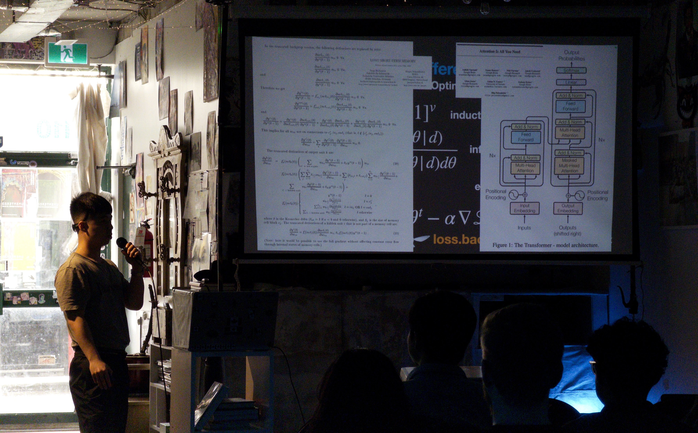

*Myself, presenting an early outline of SITP at [Toronto School of Foundation Modeling Season 1](https://tsfm.ca/schedule)*

# Preface

This book is aspirationally titled [*The Structure and Interpretation of Tensor Programs*](./front.md), (from here on in abbreviated as SITP)
as it's goal is to serve a similar role for software 2.0 as
[*The Structure and Interpretation of Computer Programs*](https://mitp-content-server.mit.edu/books/content/sectbyfn/books_pres_0/6515/sicp.zip/full-text/book/book.html)
(from here on in abbreviated as SICP) did for software 1.0.
Written by Harold Abelson and Gerald Sussman with Julie Sussman, SICP has reached consensus amongst many to be integral to the programmer canon,
providing a whirlwind tour on the essence of computation through a logically unbroken yet informal sequence, starting from programming, to programming languages
themselves*this curriculum went on to influence other texts such as it's [dual](https://cs.brown.edu/~sk/Publications/Papers/Published/fffk-htdp-vs-sicp-journal/paper.pdf) [HtDP](https://htdp.org/) (introduced at Waterloo by [Prabhakar Ragde](https://cs.uwaterloo.ca/~plragde/flaneries/FICS/Introduction.html)) it's typed counterpart [OCEB](https://cs3110.github.io/textbook/cover.html), and the [recent](https://cs.brown.edu/~sk/Publications/Papers/Published/kf-data-centric/paper.pdf) addition of [DCIC](https://dcic-world.org/) spawning from it's phylogenetic cousin [PAPL](https://papl.cs.brown.edu/2020/).*.

The programmers who loved to dive deeper into the soul of the machine by peeking under the hood of these low-level systems
went on to develop industrial languages and
runtimes*"There is only one project, architecture, operating system and languages, compiler, it's only one project. It's all together." -- Boris Babayan*.
For myself, that looked like working on [domain specific cloud compilers](https://www.infoq.com/presentations/deploy-pipelines-coinbase/)
as well as [cloud provisioners and garbage collectors](https://www.infoq.com/presentations/coinbase-terraform-earth/).
After ChatGPT, I set out to transition from domain specific cloud compilers to domain specific tensor compilers, which began in earnest during 2025 with a
[tweet](https://x.com/j4orz/status/1907452857248350421/) showcasing a deep learning framework written from scratch to run the nets from Karpathy's [Neural Networks: Zero to Hero](https://karpathy.ai/zero-to-hero.html) series. This work turned out in retrospect to be the seeds of SITP's core with [Part II. Neural Networks]()
which covers the 2012-2020 "era of research" and consists of two chapters:
- [Chapter 4. Learning *Sequences* from Data with Deep Neural Networks in `torch`](./2.md#4-learning-sequences-from-data-with-deep-neural-networks-in-torch)
- [Chapter 5. Accelerating *Sequence Models* on `GPU` in `teenygrad`](./2.md#5-accelerating-sequence-models-on-gpu-in-teenygrad-with-cuda-rust)

While it was illuminating to implement each individual torch call that the nets from `makemore` were making, my knowledge felt
fragmented*More coloquially, I was a neural network script kiddie.* with respect to the foundations and frontiers.
It was at this point in time that my aspirations grew to write a book which replicated the *form* of SICP but with the *substance* of deep learning and deep learning systems.
That is, to prepend a [Part I. Elements of Networks](./1.md) and append a [Part III. Scaling Networks]() which covers preliminary machine learning, as well as deep learning languages and runtimes respectively.
But arguably most important of all, to understand and teach the
**semantics*The difficulty of teaching programming has always been semantics. See Felleisen's [TeachScheme!](https://felleisen.org/matthias/OnHtDP/what_is_ts.html), Krishnamurthi's [Standard Model of Programming Languages](https://cs.brown.edu/~sk/Publications/Papers/Published/sk-teach-pl-post-linnaean/), Crichton's [Profiling Programing Language Learning](https://willcrichton.net/#sec-cognition)* of software 2.0 to programmers of software 1.0**.
Because although SITP as a book develops the `teenygrad` framework with a myriad of languages with `Python`, `Rust`, `CUDA Rust`, and `cuTile Rust`,
tomorrow for all we know everything can be rewritten in Julia or Mojo. I wanted to write a deep learning book for myself and others which prioritized semantics.

So in [Part I. Elements of Networks](./1.md), readers learn "pre-historic" machine learning*The exposition in Part I heavily relies on existing canon such as [Strang (1993)](), [Axler (1995)]() for preliminary linear algebra, [Hastie, Tibshirani, Friedman (2001)]() for machine learning, and [Trefethen and Bau (1997)](), [Demmel (1997)]() for numerical linear algebra, but it adds a few stylistic elements.  Namely that of infusing guiding motivation more relevant to the current regime of autoregressive sequence models inspired by [Jurafsky (2026)](), and frontloading the unsupervised learning of lower dimensional subspaces with principal component analysis inspired by [Kang and Cho (2024)]() before fitting any linear or logistic regression model.*:
- [Chapter 1. Representing *Data* with High Dimensional Stochasticity in `numpy`](./1.md#1-representing-data-with-high-dimensional-stochasticity-in-torch)
- [Chapter 2. Learning *Functions* from *Data* with Parameter Estimation in `numpy`](./1.md#2-learning-functions-from-data-with-optimization-in-torch)
- [Chapter 3. Accelerating *Functions* and *Data* on `CPU` in `teenygrad`](./1.md#3-accelerating-functions-and-data-with-basic-linear-algebra-subroutines-in-teenygrad)

And in [Part III. Scaling Networks](./3.md), readers learn about the 2020-2025 era of scaling:
- [Chapter 6. Large Language Models]()
- [Chapter 7. Reasoning Models]()
- [Chapter 8. Fusion Compilers]()
- [Chapter 9. Inference Engines ]()

For those interested in other books about deep learning systems, you can check out the excellent courses
of [minitorch](https://minitorch.github.io/) developed by Sasha Rush at Cornell and [needl](https://dlsyscourse.org/) developed by Tianqi Chen at Carnegie Mellon.

Lastly, because SITP is a book *on* artificial intelligence, the preface would be remiss if it did not discuss the questions which everyone is currently grappling such as the impact of artificial intelligence *on* education, and closely related, the impact of artificial intelligence *on* the economy.
That is, for the student in academia, why not just ask ChatGPT to *teach you about deep learning systems*?
Or for the engineer in industry, why not just ask ChatGPT to *implement a deep learning system for you?**Experiments of such kind are already happening! See the VibeTensor paper from NVIDIA by [Xu et al 2026](https://arxiv.org/pdf/2601.16238). Or for the more traditional systems, see Claude's C Compiler from [Anthropic (2026)](https://www.anthropic.com/engineering/building-c-compiler)* This is an open question which we'll see answered throughout the next few decades, but I will briefly indulge in the armchairing and provide some my personal speculations.

First, with respect to the broader economy, vibecoding becomes the new product management, research engineering becomes the new engineering, and working on deep nets becomes the new infrastructure engineering.
- The former is quite clear, given how the exact same prompts which previous product managers have tasked engineers through ticketing systems can now directly be communicated to a large language model.
- with research engineering.. However, with the latter, by "research engineer" I mean . To operationalize, this can mean like "go to mars"
- with training deep nets...

What all three have in common is instantiating a new configuration of atoms or bits with reality.
I guess if we were able to make sand do this for us we could then go all go to the beach, but then the next question becomes why not merge with them?
I suspect we will see the question answered this century, whether biological humans and artificial intelligence will
coexist in limbic system prefrontal cortex symbiotic fashion, or whether it's a 1:1 replacement like the horse and the steam engine.

Assuming that reality follows the path of the former, then we still need to educate and equip our future generations with the appropriate understanding
*Although an overused cliché, it's just like Richard Hamming said, "The purpose of computing is insight, not numbers"*
to "drive" artificial intelligence on behalf of humanity. However the next question then becomes, why not just ask ChatGPT to *teach you about deep learning systems*? You can definitely do that, and in fact, are recommended to do so*The book ships a fine-tuned Qwen for you!*.

However, I suspect that your experience with a language model will be complementary with the SITP reading experience.
Perhaps I am being humanistically chauvanist because of the bias I bring being the author of the book itself, however,
I suspect that the following resources (like teenygrad) will still be complementary used alongside language models:
- a mini ChatGPT-like language model [nanochat](http://github.com/karpathy/nanochat)
- a mini Lisp-like interpreter [metacircular evaluator](https://mitp-content-server.mit.edu/books/content/sectbyfn/books_pres_0/6515/sicp.zip/full-text/book/book-Z-H-26.html#%_sec_4.1)
- a mini C-like compiler [chibicc](https://github.com/rui314/chibicc)*in turn inspired by the one-pass [tcc](https://bellard.org/tcc/) by Fabrice Bellard*
- a mini LLVM-like SSA instruction set [Bril](https://www.cs.cornell.edu/~asampson/blog/bril.html)
- a mini Unix-like operating system [xv6](https://pdos.csail.mit.edu/6.828/2025/xv6/book-riscv-rev5.pdf)
- a mini x86-like instruction set [LC3](https://en.wikipedia.org/wiki/Little_Computer_3)
- a mini in-order microarchitecture [sodor](https://github.com/ucb-bar/riscv-sodor)
- a mini out-of-order microarchitecture [boom](https://carrv.github.io/2020/papers/CARRV2020_paper_15_Zhao.pdf)

The reason being
<!-- value add is the infusing the few bits (seed curriculum, progression)
taste. (intuition. non-verifiable. gut feel)
instantiating something new. -->

With that said, if you empathize with some of my frustrations, you may benefit from the book too. 
If you are looking for reading groups checkout the `#teenygrad` channel in  
Good luck on your journey. 
Are you ready to begin? 